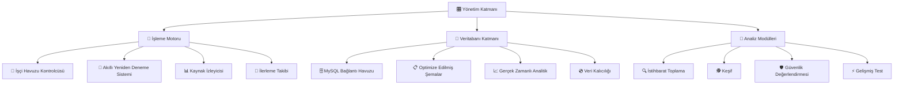

# 🚀 WebAnalyzer v3.0 - Kurumsal Domain Güvenlik ve İstihbarat Platformu

<div align="center">


### 🔥 **Profesyonel seviye domain analizi ve güvenlik değerlendirme platformu** 🔥
### ⚡ **Kurumsal toplu işleme yetenekleri ile** ⚡

[](https://github.com/frkndncr/WebAnalyzer/stargazers)
[](https://github.com/frkndncr/WebAnalyzer/network/members)

</div>

---

## 🌟 Genel Bakış

WebAnalyzer v3.0, siber güvenlik uzmanları, penetrasyon testçileri ve güvenlik araştırmacıları için tasarlanmış **en gelişmiş** Python tabanlı domain analiz çerçevesidir. Platform, keşif, güvenlik açığı değerlendirmesi ve istihbarat toplama işlemlerini **kurumsal seviyede toplu işleme yetenekleri** ile birleştirir.

### ✨ Devrimsel Özellikler

🔹 **🏢 Kurumsal Toplu İşleme**: Büyük ölçekli operasyonlar için MySQL destekli iş kuyruğu sistemi (1K-50K+ domain)  
🔹 **🧠 Yapay Zeka Destekli Analiz**: Keşiften agresif güvenlik testine kadar 12 özel modül  
🔹 **⚡ Yıldırım Performansı**: Akıllı yeniden deneme mekanizmaları, kaynak izleme ve kontrol noktası kurtarma  
🔹 **📊 Profesyonel Raporlama**: Gerçek zamanlı metrikler ve başarı takibi ile kapsamlı analitik  
🔹 **🛡️ Anti-Tespit Cephaneliği**: IP rotasyonu, kullanıcı ajanı döngüsü ve gelişmiş gizlilik yetenekleri  
🔹 **🚀 Ölçeklenebilir Mimari**: Dinamik kaynak yönetimi ile 1-50 paralel işçi desteği  

### 🎯 v3.0'da Devrimsel Yenilikler

<table>
<tr>
<td width="50%">

**🏗️ Kurumsal Altyapı:**
- 🗄️ Optimize edilmiş şemalar ile MySQL veritabanı
- 📋 İlerleme takibi ile gelişmiş iş kuyruğu
- ✅ Domain ön doğrulama sistemi
- 📈 Gerçek zamanlı performans izleme
- 🔄 Modül özel konfigürasyon ile akıllı yeniden deneme

</td>
<td width="50%">

**⚙️ Gelişmiş İşleme:**
- 👥 İşçi havuzu mimarisi (1-50 eşzamanlı)
- 📦 Dinamik batch boyutlandırma
- 💾 Kontrol noktası kurtarma sistemi
- ⏱️ Modül özel zaman aşımları
- 🔍 Akıllı güvenlik açığı tespiti

</td>
</tr>
</table>

---

## 🏛️ Sistem Mimarisi



---

## 🛠️ Kurulum ve Ayarlama

### 📋 Ön Koşullar

- 🐍 **Python 3.8+** pip paket yöneticisi ile
- 🗄️ **MySQL 8.0+** kurumsal toplu işleme için
- 🚀 **Go dili** (Subfinder entegrasyonu için)
- 💾 **4GB+ RAM** toplu işleme için önerilen

### ⚡ Hızlı Kurulum

```bash
# 📥 Repository'yi klonla
git clone https://github.com/frkndncr/WebAnalyzer.git
cd WebAnalyzer

# 📦 Python bağımlılıklarını kur
pip install -r requirements.txt

# 🗄️ Veritabanı kurulumu
# database/db_manager.py dosyasında veritabanı bağlantı bilgilerinizi güncelleyin
# Bağlantı parametrelerini güncelle:
config = {
    'host': 'mysql_host_adresiniz',
    'database': 'veritabani_adiniz',
    'user': 'kullanici_adiniz',
    'password': 'sifreniz',
    # ... diğer ayarlar
}

# 📋 Veritabanı şemasını içe aktar
mysql -u kullanici_adiniz -p veritabani_adiniz < database/schema.sql

# ✅ Kurulumu doğrula
python main.py --help
```

### ⚙️ Konfigürasyon

```bash
# 🔑 API anahtarlarını ayarla (isteğe bağlı)
export WHOIS_API_KEY="api_anahtariniz"

# ⚡ Performans ayarlarını yapılandır
export WEBANALYZER_MAX_WORKERS="10"
export WEBANALYZER_BATCH_SIZE="100"

# 🌐 Proxy konfigürasyonu (isteğe bağlı)
export WEBANALYZER_PROXY="http://proxy:8080"
```

---

## 🎮 Kullanım Kılavuzu

### 🎯 Etkileşimli Analiz (Tek Domain)

Modül seçimi ile bireysel domain analizi için mükemmel:

```bash
🚀 python main.py
# Etkileşimli komutları takip edin
# Domain ve istenen analiz modüllerini seçin
```

### 🏢 Kurumsal Toplu İşleme

Büyük ölçekli domain analizi için (100+ domain önerilen):

#### 1️⃣ Domain Hazırlama ve Doğrulama

Başarı oranlarını artırmak için domain'leri önceden doğrulayın:

```bash
# 🔍 Temel doğrulama
python domains-check.py --input domains.json --output dogrulanmis_domains.json

# ⚡ Özel ayarlarla gelişmiş doğrulama
python domains-check.py --input ham_domains.json --output temiz_domains.json --workers 15 --timeout 12
```

#### 2️⃣ İş Oluşturma ve Yönetimi

```bash
# 📋 Toplu işleme için domain'leri yükle
python bulk_scan.py --load dogrulanmis_domains.json --job-name "🔥 Kurumsal Güvenlik Denetimi"

# 📊 İş ID'sini almak için tüm işleri listele
python bulk_scan.py --list-jobs

# ⚡ Optimal ayarlarla işi işle
python bulk_scan.py --job-id 1 --workers 10

# 🚀 Yüksek performanslı işleme (güçlü sunucular)
python bulk_scan.py --job-id 1 --workers 20 --risky

# 💻 Kaynak kısıtlı işleme
python bulk_scan.py --job-id 1 --workers 3
```

#### 3️⃣ İzleme ve Kurtarma

```bash
# 📈 İş ilerlemesini izle
python bulk_scan.py --stats 1

# 🔄 Kesintiye uğrayan işi devam ettir
python bulk_scan.py --resume 1 --workers 10

# 📊 Detaylı performans metriklerini al
python monitor.py --job-id 1 --detailed
```

---

## 🔬 Analiz Modülleri

### 🔍 İstihbarat Toplama

| Modül | İşlev | Çıktı | Risk Seviyesi | Durum |
|--------|-------|-------|---------------|-------|
| **🌐 Domain Bilgileri** | WHOIS verileri, kayıt detayları | Registrar, tarihler, durum | 🟢 Düşük | ✅ Aktif |
| **🔍 DNS Analizi** | Kapsamlı DNS kayıt numaralandırması | A, MX, CNAME, TXT kayıtları | 🟢 Düşük | ✅ Aktif |
| **📈 SEO Analizi** | Arama optimizasyonu değerlendirmesi | Performans, meta etiketler, yapı | 🟢 Düşük | ✅ Geliştirildi |
| **⚙️ Web Teknolojileri** | Teknoloji yığını parmak izi | Sunucu, çerçeveler, CMS tespiti | 🟢 Düşük | ✅ Geliştirildi |

### 🕵️ Keşif

| Modül | İşlev | Çıktı | Risk Seviyesi | Durum |
|--------|-------|-------|---------------|-------|
| **🔍 Subdomain Keşfi** | Gelişmiş subdomain numaralandırması | Aktif subdomain'ler, DNS kayıtları | 🟡 Orta | ✅ Aktif |
| **👥 İletişim İstihbaratı** | İletişim bilgisi çıkarma | E-postalar, telefonlar, sosyal profiller | 🟡 Orta | ✅ Aktif |
| **📁 Gelişmiş İçerik Tarayıcısı** | Derin içerik analizi | Hassas dosyalar, dizinler | 🟡 Orta | ✅ Aktif |

### 🛡️ Güvenlik Değerlendirmesi

| Modül | İşlev | Çıktı | Risk Seviyesi | Durum |
|--------|-------|-------|---------------|-------|
| **🔒 Güvenlik Analizi** | Başlıklar, SSL/TLS, güvenlik açıkları | Güvenlik skoru, öneriler | 🟡 Orta | ✅ Geliştirildi |
| **⚠️ Subdomain Ele Geçirme** | Ele geçirme güvenlik açığı tespiti | Sömürülebilir subdomain'ler | 🔴 Yüksek | ✅ Aktif |
| **🌩️ CloudFlare Bypass** | WAF bypass teknikleri | Gerçek IP keşfi | 🔴 Yüksek | ✅ Aktif |
| **🔍 Ağ Tarayıcısı** | Port tarama, servis numaralandırması | Açık portlar, çalışan servisler | 🔴 Yüksek | ✅ Aktif |
| **🔥 API Güvenlik Tarayıcısı** | API güvenlik açığı değerlendirmesi | Güvenlik kusurları, sömürülebilir uç noktalar | 🟣 Kritik | ✅ Aktif |

---

## 📊 Performans ve Ölçeklenebilirlik

### 🏆 Benchmark Performansı

- ⚡ **İşleme Hızı**: 50-200 domain/dakika (konfigürasyona bağlı)
- 🎯 **Başarı Oranı**: Akıllı yeniden deneme mekanizmaları ile %85-95  
- 💾 **Kaynak Kullanımı**: 2-8GB RAM, orta düzey CPU kullanımı
- 🗄️ **Veritabanı Performansı**: Bağlantı havuzu ile 1.000+ sorgu/saniye
- 📦 **Eşzamanlı Kapasite**: İşleme kuyruğunda 1.000'e kadar domain

### ⚙️ Optimizasyon Kılavuzları

```python
# 🎛️ Sistem tabanlı işçi konfigürasyonu
ÖNERILEN_IŞÇILER = {
    '💻 Geliştirme (4GB RAM)': 3,
    '🏢 Üretim (8GB RAM)': 10,
    '⚡ Yüksek Performans (16GB+ RAM)': 20,
    '🏭 Kurumsal Sunucu': 30
}

# ⏱️ Modül zaman aşımı ayarları
MODÜL_ZAMAN_AŞIMLARI = {
    'security_analysis': 30,    # 🔒 Karmaşık analiz
    'web_technologies': 35,     # ⚙️ Teknoloji tespiti
    'seo_analysis': 45,         # 📈 Kapsamlı SEO
    'domain_info': 10,          # 🌐 WHOIS sorgusu
    'domain_dns': 10            # 🔍 DNS çözümleme
}
```

### 🚀 Büyük Ölçekli İşleme Örneği

25.000+ domain işlemek için:

```bash
# 1️⃣ Domain'leri ön doğrula (hataları azaltır)
python domains-check.py --input 25k_domains.json --output dogrulanmis_25k.json --workers 20

# 2️⃣ İşleme için yükle
python bulk_scan.py --load dogrulanmis_25k.json --job-name "🔥 25K Domain Güvenlik Denetimi"

# 3️⃣ Yüksek performans ayarları ile işle
python bulk_scan.py --job-id 2 --workers 15 --risky

# 4️⃣ İlerlemeyi izle (25K domain için tahmini 3-5 saat)
python bulk_scan.py --stats 2 --refresh 30
```

---

## 📁 Proje Yapısı

```
🏗️ WebAnalyzer/
├── 🎛️ main.py                          # Etkileşimli analiz arayüzü
├── 🚀 bulk_scan.py                     # Kurumsal toplu işleme motoru  
├── ✅ domains-check.py                 # Domain doğrulama yardımcı programı
├── 📊 monitor.py                       # Gerçek zamanlı izleme sistemi
├── 📈 check_progress.py               # İlerleme takip yardımcı programı
├── ⚙️ config.py                       # Konfigürasyon yönetimi
├── 🔌 webanalyzer_socket.py           # Socket iletişimi
├── 📋 webanalyzer_config.json         # Konfigürasyon dosyası
├── 📦 requirements.txt                 # Python bağımlılıkları
├── 🛠️ setup.sh                        # Kurulum otomasyonu
├── 📄 LICENSE                          # MIT Lisansı
├── 📚 README.md                       # Dokümantasyon (İngilizce)
├── 🇹🇷 README.TR.MD                    # Dokümantasyon (Türkçe)
│
├── 🗄️ database/                       # Veritabanı katmanı
│   ├── 📋 schema.sql                  # MySQL tablo tanımları
│   └── 🔗 db_manager.py              # Bağlantı havuzu ve sorgu optimizasyonu
│
├── ⚡ bulk/                          # Toplu işleme bileşenleri
│   ├── 📥 loader.py                  # Domain yükleme ve iş oluşturma
│   └── 🚀 processor.py               # Optimize edilmiş işleme motoru
│
├── 🔬 modules/                       # Analiz modülleri
│   ├── 🌐 domain_info.py             # WHOIS bilgi alma
│   ├── 🔍 domain_dns.py              # DNS kayıt analizi  
│   ├── 📈 seo_analysis.py            # SEO performans değerlendirmesi
│   ├── 🔒 security_analysis.py       # Güvenlik başlıkları ve SSL analizi
│   ├── ⚙️ web_technologies.py        # Teknoloji yığını tespiti
│   ├── ⚠️ subdomain_takeover.py      # Güvenlik açığı tespiti
│   ├── 📁 advanced_content_scanner.py # İçerik analizi
│   ├── 🌩️ cloudflare_bypass.py       # WAF bypass teknikleri
│   ├── 👥 contact_spy.py             # İletişim bilgisi çıkarma
│   ├── 🔍 nmap_zero_day.py           # Ağ güvenlik açığı tarama
│   ├── 🔥 api_security_scanner.py    # API güvenlik değerlendirmesi
│   ├── 🕵️ subfinder_tool.py          # Subdomain numaralandırma
│   └── 🔌 universal_adapter.py       # Modül yürütme çerçevesi
│
├── 🛠️ utils/                         # Çekirdek yardımcı programlar
│   ├── 📦 __init__.py                # Paket başlatma
│   ├── 🔄 session_manager.py         # Gelişmiş oturum yönetimi
│   ├── 🔧 module_wrapper.py          # Yürütme çerçevesi
│   └── 🛠️ utils.py                   # Yardımcı fonksiyonlar
│
├── 💣 payloads/                      # Güvenlik test yükleri
│   ├── 🔗 api_endpoints.txt          # API uç nokta kelime listesi
│   ├── 🔓 auth_bypass_headers.txt    # Kimlik doğrulama bypass başlıkları
│   ├── 💻 command_injection.txt      # Komut enjeksiyon yükleri
│   ├── 📁 lfi.txt                    # Yerel dosya ekleme yükleri
│   ├── 🍃 nosql_injection.txt        # NoSQL enjeksiyon yükleri
│   ├── 💉 sql_injection.txt          # SQL enjeksiyon yükleri
│   ├── 🔗 ssrf.txt                   # SSRF yükleri
│   ├── 🔧 ssti.txt                   # Sunucu tarafı şablon enjeksiyonu
│   ├── ⚡ xss.txt                     # Cross-site scripting yükleri
│   └── 📄 xxe.txt                    # XML harici varlık yükleri
│
└── 🧪 tests/                         # Test paketi
    └── ✅ test_main.py               # Birim testler
```

---

## 🏢 Kurumsal Özellikler

### 🗄️ Veritabanı Şeması

```sql
-- 📋 İş yönetimi
CREATE TABLE scan_jobs (
    id INT AUTO_INCREMENT PRIMARY KEY,
    job_name VARCHAR(255),
    total_domains INT DEFAULT 0,
    completed_domains INT DEFAULT 0,
    status ENUM('pending', 'running', 'completed', 'failed') DEFAULT 'pending',
    created_at TIMESTAMP DEFAULT CURRENT_TIMESTAMP,
    started_at TIMESTAMP NULL,
    completed_at TIMESTAMP NULL
);

-- 🌐 Domain işleme kuyruğu
CREATE TABLE domains (
    id INT AUTO_INCREMENT PRIMARY KEY,
    job_id INT,
    domain VARCHAR(255) NOT NULL,
    status ENUM('pending', 'scanning', 'completed', 'failed') DEFAULT 'pending',
    priority INT DEFAULT 5,
    retry_count INT DEFAULT 0,
    created_at TIMESTAMP DEFAULT CURRENT_TIMESTAMP,
    scanned_at TIMESTAMP NULL
);

-- 📊 Analiz sonuçları depolama
CREATE TABLE scan_results (
    id INT AUTO_INCREMENT PRIMARY KEY,
    domain_id INT,
    module_name VARCHAR(100),
    status VARCHAR(50),
    risk_level ENUM('low', 'medium', 'high', 'critical'),
    score INT,
    execution_time FLOAT,
    result_data JSON,
    error_message TEXT,
    scanned_at TIMESTAMP DEFAULT CURRENT_TIMESTAMP
);

-- ⚠️ Güvenlik açığı takibi
CREATE TABLE vulnerabilities (
    id INT AUTO_INCREMENT PRIMARY KEY,
    domain_id INT,
    vulnerability_type VARCHAR(100),
    severity ENUM('info', 'low', 'medium', 'high', 'critical'),
    module_name VARCHAR(100),
    details JSON,
    discovered_at TIMESTAMP DEFAULT CURRENT_TIMESTAMP
);
```

---

## ⚖️ Yasal ve Etik Hususlar

### 🚨 **KRİTİK YASAL UYARI** 🚨

WebAnalyzer, güvenlik açığı tarama, sömürü girişimleri ve kimlik doğrulama bypass teknikleri dahil olmak üzere **agresif güvenlik testi** yetenekli modüller içerir.

<div align="center">

⚠️ **YALNIZCA YETKİLİ KULLANIM** ⚠️

</div>

🔹 **Yalnızca sahip olduğunuz sistemleri test edin** veya açık yazılı izniniz olan sistemleri  
🔹 **Hız sınırlarına ve hizmet şartlarına** saygı gösterin  
🔹 **Keşfedilen güvenlik açıkları için sorumlu açıklama** uygulamalarını takip edin  
🔹 **Güvenlik testi ile ilgili yerel yasalara ve düzenlemelere** uyun  

<div align="center">

❌ **YETKİSİZ GÜVENLİK TESTİ YASADIŞI OLABİLİR** ❌

</div>

**SORUMLULUK REDDİ**: Kullanıcılar yasal kullanımı sağlamaktan tamamen sorumludur. Araç geliştiricileri kötüye kullanım veya zararlardan sorumlu değildir.

---

## 🤝 Destek ve Profesyonel Hizmetler

### 🌍 Topluluk Desteği
- 🐛 **GitHub Issues**: Hata raporları ve özellik istekleri
- 📚 **Dokümantasyon**: Kapsamlı kılavuzlar ve API dokümantasyonu  
- 💬 **Topluluk Forumu**: Kullanıcı tartışmaları ve en iyi uygulamalar

### 🏢 Profesyonel Hizmetler
- 🏗️ **Kurumsal Danışmanlık**: Büyük ölçekli dağıtım yardımı
- 🔧 **Özel Modül Geliştirme**: Özel analiz gereksinimleri
- 🎓 **Eğitim Programları**: Takım sertifikasyonu ve ileri düzey kullanım
- 🛠️ **Yönetilen Hizmetler**: Tamamen yönetilen güvenlik değerlendirme çözümleri

### 📞 İletişim Bilgileri

<div align="center">

| İletişim | Bağlantı |
|----------|----------|
| 👨‍💻 **Geliştirici** | [Furkan Dinçer](https://github.com/frkndncr) |
| 💼 **LinkedIn** | [Profesyonel Profil](https://www.linkedin.com/in/furkan-dincer/) |
| 📸 **Instagram** | [@f3rrkan](https://www.instagram.com/f3rrkan/) |
| 📧 **E-posta** | hi@c4softwarestudio.com |

</div>

---

## 📄 Lisans

Bu proje **MIT Lisansı** altında lisanslanmıştır - tam şartlar için LICENSE dosyasına bakın.

**🏢 Kurumsal Lisans Mevcut**: Gelişmiş özellikler, öncelikli destek ve ticari lisanslama seçenekleri için iletişime geçin.

---

<div align="center">

# 🚀 **Kurumsal ölçekte güvenlik değerlendirmeleri için hazır mısınız?** 🚀

<br/>

[](https://github.com/frkndncr/WebAnalyzer/releases/latest)
[](https://github.com/frkndncr/WebAnalyzer/wiki)
[](mailto:hi@c4softwarestudio.com)

<br/>

### 🎯 Siber güvenlik topluluğu için [**Furkan Dinçer**](https://github.com/frkndncr) tarafından titizlikle geliştirildi 🎯

<br/>

## ⭐ **Profesyonel güvenlik araçları gelişimini desteklemek için bu repository'yi yıldızlayın** ⭐

<br/>


<br/>

### 🔥 **WebAnalyzer v3.0 - Nihai Domain Güvenlik Platformu** 🔥

</div>