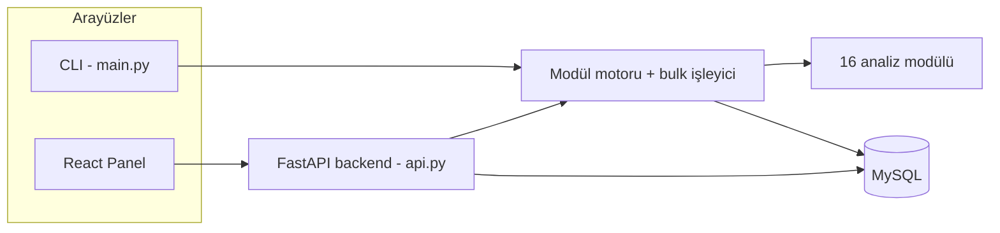

<div align="center">

# WebAnalyzer

### Açık kaynak keşif (reconnaissance) paneli

**Bir alan adına 16 keşif ve güvenlik modülünü tek arayüzden çalıştırın — sonucu paylaşılabilir bir rapora dönüştürün.**

WebAnalyzer pasif OSINT keşfi ile aktif zafiyet değerlendirmesi arasında köprü kurar, bunu gerçek bir panele sarar ve sonunda size yönetici düzeyinde bir rapor verir. Sızma testi uzmanları, bug bounty avcıları ve güvenlik araştırmacıları için tasarlandı.

[](https://github.com/frkndncr/WebAnalyzer/releases)
[](https://www.python.org/)
[](LICENSE)
[](https://pypi.org/project/webanalyzer-security/)
[](https://github.com/frkndncr/WebAnalyzer/actions/workflows/ci.yml)
[](https://github.com/frkndncr/WebAnalyzer/stargazers)

**[🖥️ Canlı Panel](https://webanalyzer.c4softwarestudio.com/) · [⚡ API & Dokümanlar](https://webanalyzer-api.onrender.com/docs) · [📝 Detaylı Makale](https://medium.com/@frkndncr/webanalyzer-next-gen-domain-reconnaissance-vulnerability-scanner-94fe899a64d1)**


*(English README: [README.md](README.md))*

</div>

---

## Neden WebAnalyzer?

Keşif araçlarının çoğu, kendinizin birbirine bağladığı ayrı CLI'lardan oluşur. WebAnalyzer tam tersini yapar:

- **🎛️ Tek arayüz, çok araç.** WHOIS, DNS, subdomain, WAF parmak izi, SSL/TLS, CloudFlare origin IP açığa çıkarma, port tarama, içerik & secret tarama, API testi — tarama başına seçilebilir, CLI *veya* web panelinden.
- **📊 Sadece log değil, panel.** React tabanlı komuta merkezi; skorları, bulguları, ağ haritalarını, tehdit istihbaratını ve saldırı yollarını gerçek zamanlı görselleştirir — sonuçlar MySQL'e kalıcı yazılır, oturumlar arası hiçbir şey kaybolmaz.
- **📄 Teslim edilebilir raporlar.** Her tarama JSON, CSV veya iyileştirme önerileri içeren şık yönetici HTML/PDF güvenlik raporu olarak dışa aktarılabilir.
- **🛡️ Gerçek hedefler için dayanıklı.** User-agent rotasyonu, adaptif rate-limit geri çekilmesi, proxy kancaları ve WAF-farkında hız ayarı, korumalı altyapılarda taramanın devam etmesini sağlar.

> WebAnalyzer, `nuclei` veya `amass`'ı geçmeye çalışmaz — kanıtlanmış keşif tekniklerinin üzerine **bütünleşik bir arayüz ve raporlama katmanı** koyar.

---

## Hızlı başlangıç

### 🐳 Docker Compose (önerilen — tek komut)

MySQL veritabanı, FastAPI backend ve React panelini birlikte ayağa kaldırır; tüm sistem bağımlılıkları (Python, Go, Node, Nmap, Subfinder) hazır gelir.

```bash
git clone https://github.com/frkndncr/WebAnalyzer.git
cd WebAnalyzer
docker compose up -d --build
```

- **Panel:** http://localhost:8080
- **API dokümanları:** http://localhost:8000/docs

### 📦 pip (yalnızca CLI)

```bash
pip install webanalyzer-security
webanalyzer
```

### ⚡ Manuel (geliştirici modu)

```bash
git clone https://github.com/frkndncr/WebAnalyzer.git
cd WebAnalyzer
pip install -r requirements.txt

# Backend
uvicorn api:app --host 0.0.0.0 --port 8000 --reload

# Frontend (ikinci bir terminalde)
cd dashboard && npm install && npm run dev   # http://localhost:5173
```

Tekil taramalar için veritabanı opsiyoneldir (sonuçlar `logs/<domain>/results.json`'a da yazılır). Kalıcı depolama için `DB_HOST`, `DB_NAME`, `DB_USER`, `DB_PASSWORD` ayarlayın — şema ilk bağlantıda otomatik oluşturulur.

> **Herkese açık bir sunucu mu barındırıyorsunuz?** `DEMO_MODE=true` ayarlayın; tarama isteklerini istemci başına sınırlar ve iç/özel/ayrılmış hedefleri reddeder (SSRF koruması). Varsayılan kapalıdır, böylece self-host kullanıcıları kendi altyapılarını tarayabilir. Bkz. [`.env.example`](.env.example).

---

## Ne yapar?

<div align="center">

</div>

### Analiz modülleri

| Modül | Bulduğu şey | Risk |
|-------|-------------|:----:|
| **Domain Bilgisi** | WHOIS, registrar, kayıt & bitiş tarihleri | 🟢 |
| **DNS Analizi** | A / AAAA / MX / TXT / CNAME kayıtları | 🟢 |
| **SEO Analizi** | Meta etiketleri, Open Graph, indeksleme sinyalleri | 🟢 |
| **Web Teknolojileri** | Sunucu, framework, CMS parmak izi | 🟢 |
| **GEO Analizi** | IP coğrafi konumu & barındırma sağlayıcısı | 🟢 |
| **Güvenlik Analizi** | Header'lar, SSL/TLS, WAF tespiti, skorlama | 🟡 |
| **Subdomain Keşfi** | Subdomain sıralama (Subfinder) | 🟡 |
| **İletişim İstihbaratı** | E-posta, telefon, sosyal profiller | 🟡 |
| **Gelişmiş İçerik Tarama** | Derin crawl, secret'lar, JS taint analizi, SSRF | 🟡 |
| **Web Arşiv Casusu** | Wayback Machine geçmiş secret taraması | 🟡 |
| **SSL SAN İlişkilendirme** | crt.sh & sertifika tabanlı varlık haritalama | 🟡 |
| **Subdomain Takeover** | Dangling CNAME / takeover tespiti | 🔴 |
| **CloudFlare Bypass** | WAF arkasındaki origin IP'yi açığa çıkarma | 🔴 |
| **Nmap Zero-Day Tarama** | Port tarama & servis parmak izi | 🔴 |
| **Phishing Tespiti** | Typosquat / benzer alan adı çözümleyici | 🔴 |
| **API Güvenlik Tarayıcı** | API endpoint keşfi & zafiyet testi | 🟣 |

Ayrıca bulguları mantıksal bir istismar yol haritasına dönüştüren bir **Saldırı Yolu Planlayıcı** vardır. Ayrıntılar için [`docs/Modules.md`](docs/Modules.md).

### Bulk (toplu) işleme

Büyük işler için (yüzlerce–50K+ alan adı), WebAnalyzer worker havuzları, yeniden denemeler ve checkpoint kurtarma içeren MySQL destekli bir kuyruk sunar:

```bash
python domains-check.py --input domains.json --output validated.json   # ön doğrulama
python bulk_scan.py --load validated.json --job-name "Güvenlik Denetimi" # iş oluştur
python bulk_scan.py --job-id 1 --workers 10                             # çalıştır
python bulk_scan.py --stats 1                                           # izle
```

---

## Mimari


```mermaid
graph LR
    subgraph Arayüzler
      CLI[CLI - main.py]
      UI[React Panel]
    end
    API[FastAPI backend - api.py]
    ENG[Modül motoru + bulk işleyici]
    DB[(MySQL)]
    MODS[16 analiz modülü]

    CLI --> ENG
    UI --> API --> ENG --> MODS
    ENG --> DB
    API --> DB
```

- **Backend:** Python 3.8+, FastAPI, modül yürütme çerçevesi ve bağlantı havuzlu opsiyonel MySQL katmanı. Bulk mod, yeniden deneme ve checkpoint kurtarma içeren bir iş kuyruğuyla 1K–50K+ alan adı işler.
- **Frontend:** React 19 + Vite, merkezi API istemcisi, canlı polling ve elle yazılmış SVG görselleştirmeler.
- **Depolama:** MySQL kalıcı doğruluk kaynağıdır; yerel JSON bir yedek önbellektir.

Ayrıntılar: [`docs/Architecture.md`](docs/Architecture.md).

---

## ⚖️ Yasal & etik kullanım

WebAnalyzer **aktif güvenlik testi** yapabilen modüller içerir (zafiyet tarama, origin açığa çıkarma, kimlik doğrulama atlatma kontrolleri).

> **Yalnızca sahibi olduğunuz veya test etmek için açıkça yetkilendirildiğiniz sistemleri tarayın.**

Rate limitlere ve hizmet şartlarına uyun, sorumlu ifşa (responsible disclosure) yapın ve bulunduğunuz yargı bölgesinin yasalarına uyun. Yetkisiz güvenlik testi yasa dışı olabilir. Geliştiriciler kötüye kullanımdan sorumlu değildir. Herkese açık demo yalnızca değerlendirme amaçlıdır — sahibi olmadığınız sistemleri test etmek için kullanmayın.

---

## Katkı

Katkılar memnuniyetle karşılanır — issue'lar, özellik istekleri ve pull request'ler. Bkz. [`CONTRIBUTING.md`](CONTRIBUTING.md) ve [issue şablonları](.github/ISSUE_TEMPLATE). İyi başlangıç noktaları: yeni bir analiz modülü, panel iyileştirmeleri veya test kapsamı.

```bash
# Backend test paketi
pip install pytest && pytest

# Frontend test + lint
cd dashboard && npm install && npm run test && npm run lint
```

---

## Dokümanlar

- [Mimari](docs/Architecture.md)
- [Özellikler](docs/Features.md)
- [Modüller](docs/Modules.md)
- [Gelişmiş İçerik Tarayıcı derinlemesine](docs/detailed-documentation/advanced_content_scanner)
- [Changelog](CHANGELOG.md) · [English README](README.md)

---

## Lisans & geliştirici

[MIT Lisansı](LICENSE) ile yayınlanmıştır.

**[Furkan Dinçer](https://github.com/frkndncr)** tarafından geliştirildi — [LinkedIn](https://www.linkedin.com/in/furkan-dincer/) · [Instagram](https://www.instagram.com/f3rrkan/) · hi@c4softwarestudio.com

<div align="center">

**WebAnalyzer işinize yarıyorsa bir ⭐ bırakmayı düşünün — gerçekten yardımcı oluyor.**

</div>
