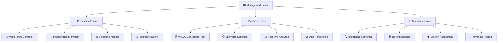

# 🚀 WebAnalyzer v3.0 - Enterprise Domain Security & Intelligence Platform

<div align="center">


### 🔥 **Professional-grade domain analysis and security assessment platform** 🔥
### ⚡ **Now with enterprise bulk processing capabilities** ⚡

[](https://github.com/frkndncr/WebAnalyzer/stargazers)
[](https://github.com/frkndncr/WebAnalyzer/network/members)

</div>

---

## 🌟 Overview

WebAnalyzer v3.0 is the **most advanced** Python-based domain analysis framework designed for cybersecurity professionals, penetration testers, and security researchers. The platform combines reconnaissance, vulnerability assessment, and intelligence gathering with **enterprise-grade bulk processing capabilities**.

### ✨ Revolutionary Features

🔹 **🏢 Enterprise Bulk Processing**: MySQL-backed job queue system for massive scale operations (1K-50K+ domains)  
🔹 **🧠 AI-Powered Analysis**: 12 specialized modules from reconnaissance to aggressive security testing  
🔹 **⚡ Lightning Performance**: Smart retry mechanisms, resource monitoring, and checkpoint recovery  
🔹 **📊 Professional Reporting**: Comprehensive analytics with real-time metrics and success tracking  
🔹 **🛡️ Anti-Detection Arsenal**: IP rotation, user-agent cycling, and advanced stealth capabilities  
🔹 **🚀 Scalable Architecture**: Support for 1-50 parallel workers with dynamic resource management  

### 🎯 What's Revolutionary in v3.0

<table>
<tr>
<td width="50%">

**🏗️ Enterprise Infrastructure:**
- 🗄️ MySQL database with optimized schemas
- 📋 Advanced job queue with progress tracking
- ✅ Domain pre-validation system
- 📈 Real-time performance monitoring
- 🔄 Intelligent retry with module-specific config

</td>
<td width="50%">

**⚙️ Enhanced Processing:**
- 👥 Worker pool architecture (1-50 concurrent)
- 📦 Dynamic batch sizing
- 💾 Checkpoint recovery system
- ⏱️ Module-specific timeouts
- 🔍 Smart vulnerability detection

</td>
</tr>
</table>

---

## 🏛️ System Architecture



---

## 🛠️ Installation & Setup

### 📋 Prerequisites

- 🐍 **Python 3.8+** with pip package manager
- 🗄️ **MySQL 8.0+** for enterprise bulk processing
- 🚀 **Go language** (for Subfinder integration)
- 💾 **4GB+ RAM** recommended for bulk processing

### ⚡ Quick Installation

```bash
# 📥 Clone the repository
git clone https://github.com/frkndncr/WebAnalyzer.git
cd WebAnalyzer

# 📦 Install Python dependencies
pip install -r requirements.txt

# 🗄️ Database setup
# Configure your database connection in database/db_manager.py
# Update connection parameters:
config = {
    'host': 'your_mysql_host',
    'database': 'your_database_name',
    'user': 'your_username',
    'password': 'your_password',
    # ... other settings
}

# 📋 Import database schema
mysql -u your_username -p your_database < database/schema.sql

# ✅ Verify installation
python main.py --help
```

### ⚙️ Configuration

```bash
# 🔑 Set API keys (optional)
export WHOIS_API_KEY="your_api_key"

# ⚡ Configure performance settings
export WEBANALYZER_MAX_WORKERS="10"
export WEBANALYZER_BATCH_SIZE="100"

# 🌐 Proxy configuration (optional)
export WEBANALYZER_PROXY="http://proxy:8080"
```

---

## 🎮 Usage Guide

### 🎯 Interactive Analysis (Single Domain)

Perfect for individual domain analysis with module selection:

```bash
🚀 python main.py
# Follow the interactive prompts
# Select domain and desired analysis modules
```

### 🏢 Enterprise Bulk Processing

For large-scale domain analysis (recommended for 100+ domains):

#### 1️⃣ Domain Preparation & Validation

Pre-validate domains to boost success rates:

```bash
# 🔍 Basic validation
python domains-check.py --input domains.json --output validated_domains.json

# ⚡ Advanced validation with custom settings
python domains-check.py --input raw_domains.json --output clean_domains.json --workers 15 --timeout 12
```

#### 2️⃣ Job Creation & Management

```bash
# 📋 Load domains for bulk processing
python bulk_scan.py --load validated_domains.json --job-name "🔥 Enterprise Security Audit"

# 📊 List all jobs to get job ID
python bulk_scan.py --list-jobs

# ⚡ Process job with optimal settings
python bulk_scan.py --job-id 1 --workers 10

# 🚀 High-performance processing (powerful servers)
python bulk_scan.py --job-id 1 --workers 20 --risky

# 💻 Resource-constrained processing
python bulk_scan.py --job-id 1 --workers 3
```

#### 3️⃣ Monitoring & Recovery

```bash
# 📈 Monitor job progress
python bulk_scan.py --stats 1

# 🔄 Resume interrupted job
python bulk_scan.py --resume 1 --workers 10

# 📊 Get detailed performance metrics
python monitor.py --job-id 1 --detailed
```

---

## 🔬 Analysis Modules

### 🔍 Intelligence Gathering

| Module | Function | Output | Risk Level | Status |
|--------|----------|--------|------------|---------|
| **🌐 Domain Information** | WHOIS data, registration details | Registrar, dates, status | 🟢 Low | ✅ Active |
| **🔍 DNS Analysis** | Comprehensive DNS record enumeration | A, MX, CNAME, TXT records | 🟢 Low | ✅ Active |
| **📈 SEO Analysis** | Search optimization assessment | Performance, meta tags, structure | 🟢 Low | ✅ Enhanced |
| **⚙️ Web Technologies** | Technology stack fingerprinting | Server, frameworks, CMS detection | 🟢 Low | ✅ Enhanced |

### 🕵️ Reconnaissance

| Module | Function | Output | Risk Level | Status |
|--------|----------|--------|------------|---------|
| **🔍 Subdomain Discovery** | Advanced subdomain enumeration | Active subdomains, DNS records | 🟡 Medium | ✅ Active |
| **👥 Contact Intelligence** | Contact information extraction | Emails, phones, social profiles | 🟡 Medium | ✅ Active |
| **📁 Advanced Content Scanner** | Deep content analysis | Sensitive files, directories | 🟡 Medium | ✅ Active |

### 🛡️ Security Assessment

| Module | Function | Output | Risk Level | Status |
|--------|----------|--------|------------|---------|
| **🔒 Security Analysis** | Headers, SSL/TLS, vulnerabilities | Security score, recommendations | 🟡 Medium | ✅ Enhanced |
| **⚠️ Subdomain Takeover** | Takeover vulnerability detection | Exploitable subdomains | 🔴 High | ✅ Active |
| **🌩️ CloudFlare Bypass** | WAF bypass techniques | Real IP discovery | 🔴 High | ✅ Active |
| **🔍 Network Scanner** | Port scanning, service enumeration | Open ports, running services | 🔴 High | ✅ Active |
| **🔥 API Security Scanner** | API vulnerability assessment | Security flaws, exploitable endpoints | 🟣 Critical | ✅ Active |

---

## 📊 Performance & Scalability

### 🏆 Benchmark Performance

- ⚡ **Processing Speed**: 50-200 domains/minute (configuration dependent)
- 🎯 **Success Rate**: 85-95% with intelligent retry mechanisms  
- 💾 **Resource Usage**: 2-8GB RAM, moderate CPU utilization
- 🗄️ **Database Performance**: 1,000+ queries/second with connection pooling
- 📦 **Concurrent Capacity**: Up to 1,000 domains in processing queue

### ⚙️ Optimization Guidelines

```python
# 🎛️ System-based worker configuration
RECOMMENDED_WORKERS = {
    '💻 Development (4GB RAM)': 3,
    '🏢 Production (8GB RAM)': 10,
    '⚡ High-Performance (16GB+ RAM)': 20,
    '🏭 Enterprise Server': 30
}

# ⏱️ Module timeout settings
MODULE_TIMEOUTS = {
    'security_analysis': 30,    # 🔒 Complex analysis
    'web_technologies': 35,     # ⚙️ Technology detection
    'seo_analysis': 45,         # 📈 Comprehensive SEO
    'domain_info': 10,          # 🌐 WHOIS lookup
    'domain_dns': 10            # 🔍 DNS resolution
}
```

### 🚀 Large-Scale Processing Example

For processing 25,000+ domains:

```bash
# 1️⃣ Pre-validate domains (reduces failures)
python domains-check.py --input 25k_domains.json --output validated_25k.json --workers 20

# 2️⃣ Load for processing
python bulk_scan.py --load validated_25k.json --job-name "🔥 25K Domain Security Audit"

# 3️⃣ Process with high-performance settings
python bulk_scan.py --job-id 2 --workers 15 --risky

# 4️⃣ Monitor progress (estimated 3-5 hours for 25K domains)
python bulk_scan.py --stats 2 --refresh 30
```

---

## 📁 Project Structure

```
🏗️ WebAnalyzer/
├── 🎛️ main.py                          # Interactive analysis interface
├── 🚀 bulk_scan.py                     # Enterprise bulk processing engine  
├── ✅ domains-check.py                 # Domain validation utility
├── 📊 monitor.py                       # Real-time monitoring system
├── 📈 check_progress.py               # Progress tracking utility
├── ⚙️ config.py                       # Configuration management
├── 🔌 webanalyzer_socket.py           # Socket communication
├── 📋 webanalyzer_config.json         # Configuration file
├── 📦 requirements.txt                 # Python dependencies
├── 🛠️ setup.sh                        # Installation automation
├── 📄 LICENSE                          # MIT License
├── 📚 README.md                       # Documentation (English)
├── 🇹🇷 README.TR.MD                    # Documentation (Turkish)
│
├── 🗄️ database/                       # Database layer
│   ├── 📋 schema.sql                  # MySQL table definitions
│   └── 🔗 db_manager.py              # Connection pool & query optimization
│
├── ⚡ bulk/                          # Bulk processing components
│   ├── 📥 loader.py                  # Domain loading & job creation
│   └── 🚀 processor.py               # Optimized processing engine
│
├── 🔬 modules/                       # Analysis modules
│   ├── 🌐 domain_info.py             # WHOIS information retrieval
│   ├── 🔍 domain_dns.py              # DNS record analysis  
│   ├── 📈 seo_analysis.py            # SEO performance assessment
│   ├── 🔒 security_analysis.py       # Security headers & SSL analysis
│   ├── ⚙️ web_technologies.py        # Technology stack detection
│   ├── ⚠️ subdomain_takeover.py      # Vulnerability detection
│   ├── 📁 advanced_content_scanner.py # Content analysis
│   ├── 🌩️ cloudflare_bypass.py       # WAF bypass techniques
│   ├── 👥 contact_spy.py             # Contact information extraction
│   ├── 🔍 nmap_zero_day.py           # Network vulnerability scanning
│   ├── 🔥 api_security_scanner.py    # API security assessment
│   ├── 🕵️ subfinder_tool.py          # Subdomain enumeration
│   └── 🔌 universal_adapter.py       # Module execution framework
│
├── 🛠️ utils/                         # Core utilities
│   ├── 📦 __init__.py                # Package initialization
│   ├── 🔄 session_manager.py         # Advanced session management
│   ├── 🔧 module_wrapper.py          # Execution framework
│   └── 🛠️ utils.py                   # Helper functions
│
├── 💣 payloads/                      # Security testing payloads
│   ├── 🔗 api_endpoints.txt          # API endpoint wordlist
│   ├── 🔓 auth_bypass_headers.txt    # Authentication bypass headers
│   ├── 💻 command_injection.txt      # Command injection payloads
│   ├── 📁 lfi.txt                    # Local file inclusion payloads
│   ├── 🍃 nosql_injection.txt        # NoSQL injection payloads
│   ├── 💉 sql_injection.txt          # SQL injection payloads
│   ├── 🔗 ssrf.txt                   # SSRF payloads
│   ├── 🔧 ssti.txt                   # Server-side template injection
│   ├── ⚡ xss.txt                     # Cross-site scripting payloads
│   └── 📄 xxe.txt                    # XML external entity payloads
│
└── 🧪 tests/                         # Test suite
    └── ✅ test_main.py               # Unit tests
```

---

## 🏢 Enterprise Features

### 🗄️ Database Schema

```sql
-- 📋 Job management
CREATE TABLE scan_jobs (
    id INT AUTO_INCREMENT PRIMARY KEY,
    job_name VARCHAR(255),
    total_domains INT DEFAULT 0,
    completed_domains INT DEFAULT 0,
    status ENUM('pending', 'running', 'completed', 'failed') DEFAULT 'pending',
    created_at TIMESTAMP DEFAULT CURRENT_TIMESTAMP,
    started_at TIMESTAMP NULL,
    completed_at TIMESTAMP NULL
);

-- 🌐 Domain processing queue
CREATE TABLE domains (
    id INT AUTO_INCREMENT PRIMARY KEY,
    job_id INT,
    domain VARCHAR(255) NOT NULL,
    status ENUM('pending', 'scanning', 'completed', 'failed') DEFAULT 'pending',
    priority INT DEFAULT 5,
    retry_count INT DEFAULT 0,
    created_at TIMESTAMP DEFAULT CURRENT_TIMESTAMP,
    scanned_at TIMESTAMP NULL
);

-- 📊 Analysis results storage
CREATE TABLE scan_results (
    id INT AUTO_INCREMENT PRIMARY KEY,
    domain_id INT,
    module_name VARCHAR(100),
    status VARCHAR(50),
    risk_level ENUM('low', 'medium', 'high', 'critical'),
    score INT,
    execution_time FLOAT,
    result_data JSON,
    error_message TEXT,
    scanned_at TIMESTAMP DEFAULT CURRENT_TIMESTAMP
);

-- ⚠️ Vulnerability tracking
CREATE TABLE vulnerabilities (
    id INT AUTO_INCREMENT PRIMARY KEY,
    domain_id INT,
    vulnerability_type VARCHAR(100),
    severity ENUM('info', 'low', 'medium', 'high', 'critical'),
    module_name VARCHAR(100),
    details JSON,
    discovered_at TIMESTAMP DEFAULT CURRENT_TIMESTAMP
);
```

### ⚙️ Advanced Configuration

```python
# 🚀 Worker pool optimization
BULK_PROCESSING_CONFIG = {
    'max_workers': 20,
    'batch_size': 100,
    'checkpoint_interval': 60,
    'retry_attempts': {
        'security_analysis': 3,
        'web_technologies': 4,
        'seo_analysis': 4,
        'domain_dns': 2
    },
    'timeout_settings': {
        'security_analysis': 30,
        'web_technologies': 45,
        'seo_analysis': 45,
        'domain_info': 10,
        'domain_dns': 10
    }
}
```

---

## ⚖️ Legal & Ethical Considerations

### 🚨 **CRITICAL LEGAL NOTICE** 🚨

WebAnalyzer includes modules capable of **aggressive security testing** including vulnerability scanning, exploitation attempts, and authentication bypass techniques. 

<div align="center">

⚠️ **AUTHORIZED USE ONLY** ⚠️

</div>

🔹 **Only test systems you own** or have explicit written permission to test  
🔹 **Respect rate limits** and terms of service  
🔹 **Follow responsible disclosure** practices for discovered vulnerabilities  
🔹 **Comply with local laws** and regulations regarding security testing  

<div align="center">

❌ **UNAUTHORIZED SECURITY TESTING MAY BE ILLEGAL** ❌

</div>

**DISCLAIMER**: Users are solely responsible for ensuring lawful use. Tool developers are not liable for misuse or damages.

---

## 🤝 Support & Professional Services

### 🌍 Community Support
- 🐛 **GitHub Issues**: Bug reports and feature requests
- 📚 **Documentation**: Comprehensive guides and API documentation  
- 💬 **Community Forum**: User discussions and best practices

### 🏢 Professional Services
- 🏗️ **Enterprise Consulting**: Large-scale deployment assistance
- 🔧 **Custom Module Development**: Specialized analysis requirements
- 🎓 **Training Programs**: Team certification and advanced usage
- 🛠️ **Managed Services**: Fully managed security assessment solutions

### 📞 Contact Information

<div align="center">

| Contact | Link |
|---------|------|
| 👨‍💻 **Developer** | [Furkan Dinçer](https://github.com/frkndncr) |
| 💼 **LinkedIn** | [Professional Profile](https://www.linkedin.com/in/furkan-dincer/) |
| 📸 **Instagram** | [@f3rrkan](https://www.instagram.com/f3rrkan/) |
| 📧 **Email** | hi@c4softwarestudio.com |

</div>

---

## 📄 License

This project is licensed under the **MIT License** - see the LICENSE file for complete terms.

**🏢 Enterprise License Available**: Contact for advanced features, priority support, and commercial licensing options.

---

<div align="center">

# 🚀 **Ready for enterprise-scale security assessments?** 🚀

<br/>

[](https://github.com/frkndncr/WebAnalyzer/releases/latest)
[](https://github.com/frkndncr/WebAnalyzer/wiki)
[](mailto:hi@c4softwarestudio.com)

<br/>

### 🎯 Built with precision by [**Furkan Dinçer**](https://github.com/frkndncr) for the cybersecurity community 🎯

<br/>

## ⭐ **Star this repository to support professional security tools development** ⭐

<br/>


<br/>

### 🔥 **WebAnalyzer v3.0 - The Ultimate Domain Security Platform** 🔥

</div>