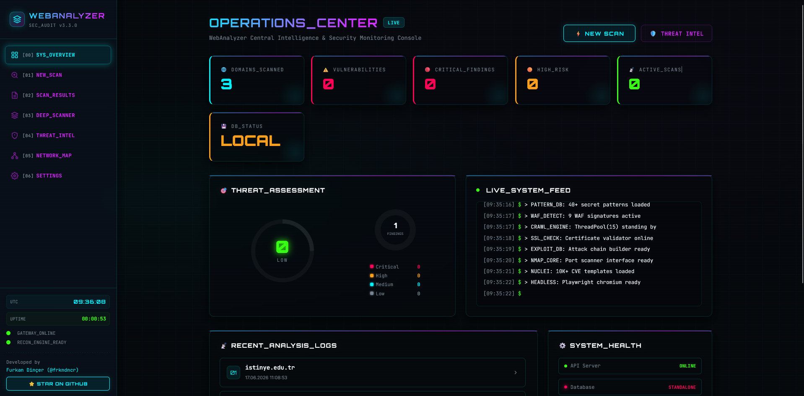
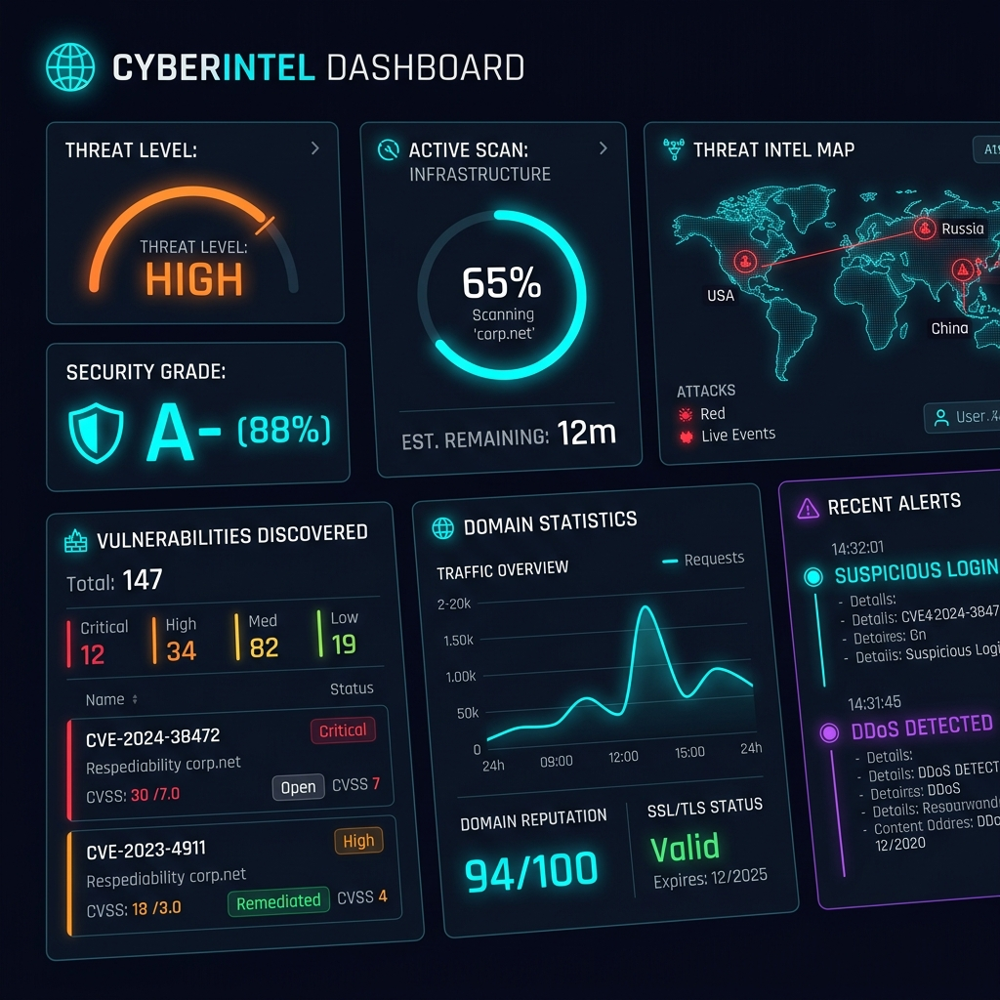
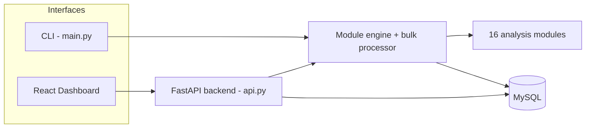

<div align="center">

# WebAnalyzer

### The open-source reconnaissance dashboard

**Run 16 recon & security modules against a domain from one interface — then turn the results into a shareable report.**

WebAnalyzer bridges passive OSINT enumeration and active vulnerability assessment, wraps it in a real dashboard, and gives you an executive report at the end. Built for penetration testers, bug bounty hunters, and security researchers.

[](https://github.com/frkndncr/WebAnalyzer/releases)
[](https://www.python.org/)
[](LICENSE)
[](https://pypi.org/project/webanalyzer-security/)
[](https://github.com/frkndncr/WebAnalyzer/actions/workflows/ci.yml)
[](https://github.com/frkndncr/WebAnalyzer/stargazers)

**[🖥️ Live Dashboard](https://webanalyzer.c4softwarestudio.com/) · [⚡ API & Docs](https://webanalyzer-api.onrender.com/docs) · [📝 Deep-dive Article](https://medium.com/@frkndncr/webanalyzer-next-gen-domain-reconnaissance-vulnerability-scanner-94fe899a64d1)**



</div>

---

## Why WebAnalyzer?

Most reconnaissance tooling is a pile of separate CLIs you glue together yourself. WebAnalyzer takes the opposite approach:

- **🎛️ One interface, many tools.** WHOIS, DNS, subdomains, WAF fingerprinting, SSL/TLS, CloudFlare origin unmasking, port scanning, content & secret scanning, API testing — selectable per scan, from a CLI *or* a web dashboard.
- **📊 A dashboard, not just logs.** A React command center visualizes scores, findings, network maps, threat intel and attack paths in real time — with results persisted to MySQL so nothing is lost between sessions.
- **📄 Reports you can hand over.** Every scan can be exported as JSON, CSV, or a styled executive HTML/PDF security report with remediation advice.
- **🛡️ Built to survive real targets.** User-agent rotation, adaptive rate-limit backoff, proxy hooks and WAF-aware pacing keep scans running against protected infrastructure.

> WebAnalyzer doesn't try to out-scan `nuclei` or `amass` — it gives you a cohesive **interface and reporting layer** on top of proven reconnaissance techniques.

---

## Quick start

### 🐳 Docker Compose (recommended — everything in one command)

Spins up the MySQL database, FastAPI backend, and React dashboard together, with all system dependencies (Python, Go, Node, Nmap, Subfinder) baked in.

```bash
git clone https://github.com/frkndncr/WebAnalyzer.git
cd WebAnalyzer
docker compose up -d --build
```

- **Dashboard:** http://localhost:8080
- **API docs:** http://localhost:8000/docs

### 📦 pip (CLI only)

```bash
pip install webanalyzer-security
webanalyzer
```

### ⚡ Manual (developer mode)

```bash
git clone https://github.com/frkndncr/WebAnalyzer.git
cd WebAnalyzer
pip install -r requirements.txt

# Backend
uvicorn api:app --host 0.0.0.0 --port 8000 --reload

# Frontend (in a second terminal)
cd dashboard && npm install && npm run dev   # http://localhost:5173
```

The database is optional for single scans (results also persist to `logs/<domain>/results.json`). To enable durable storage, set `DB_HOST`, `DB_NAME`, `DB_USER`, `DB_PASSWORD` — the schema auto-initializes on first connect.

> **Hosting a public instance?** Set `DEMO_MODE=true` to rate-limit scan requests per client and refuse internal/private/reserved targets (SSRF protection). It's off by default so self-hosted users can scan their own infrastructure. See [`.env.example`](.env.example).

---

## What it does

<div align="center">

</div>

### Analysis modules

| Module | What it finds | Risk |
|--------|---------------|:----:|
| **Domain Information** | WHOIS, registrar, registration & expiry dates | 🟢 |
| **DNS Analysis** | A / AAAA / MX / TXT / CNAME records | 🟢 |
| **SEO Analysis** | Meta tags, Open Graph, indexing signals | 🟢 |
| **Web Technologies** | Server, frameworks, CMS fingerprinting | 🟢 |
| **GEO Analysis** | IP geolocation & hosting provider | 🟢 |
| **Security Analysis** | Headers, SSL/TLS, WAF detection, scoring | 🟡 |
| **Subdomain Discovery** | Subdomain enumeration (Subfinder) | 🟡 |
| **Contact Intelligence** | Emails, phones, social profiles | 🟡 |
| **Advanced Content Scan** | Deep crawl, secrets, JS taint analysis, SSRF | 🟡 |
| **Web Archive Spy** | Wayback Machine historical secret scraping | 🟡 |
| **SSL SAN Association** | crt.sh & certificate-based asset mapping | 🟡 |
| **Subdomain Takeover** | Dangling CNAME / takeover detection | 🔴 |
| **CloudFlare Bypass** | Origin IP unmasking behind the WAF | 🔴 |
| **Nmap Zero-Day Scan** | Port scanning & service fingerprinting | 🔴 |
| **Phishing Detection** | Typosquatted / look-alike domain resolver | 🔴 |
| **API Security Scanner** | API endpoint discovery & vulnerability testing | 🟣 |

Plus an **Attack Path Planner** that chains findings into a logical exploit roadmap. See [`docs/Modules.md`](docs/Modules.md) for details.

### Bulk processing

For large jobs (100s–50K+ domains), WebAnalyzer ships a MySQL-backed queue with worker pools, retries and checkpoint recovery:

```bash
python domains-check.py --input domains.json --output validated.json   # pre-validate
python bulk_scan.py --load validated.json --job-name "Security Audit"   # create a job
python bulk_scan.py --job-id 1 --workers 10                             # run it
python bulk_scan.py --stats 1                                           # monitor
```

### Highlighted capabilities

- **Origin IP unmasking** — historical DNS records, subdomain leakage, and SSL SAN validation to find the real IP behind CloudFlare.
- **Secrets & JS analysis** — Shannon-entropy secret hunting with a 40+ pattern registry, plus taint tracking of `location.search`/`.hash` → `innerHTML`/`eval` DOM-XSS flows.
- **Heuristic API detection** — distinguishes real JSON/XML endpoints from HTML-in-404 noise via headers, server stack and response structure.
- **Evasion** — session/user-agent rotation, adaptive HTTP 429 backoff, and WAF-aware pacing. See [`docs/Features.md`](docs/Features.md).

---

## Architecture


```mermaid
graph LR
    subgraph Interfaces
      CLI[CLI - main.py]
      UI[React Dashboard]
    end
    API[FastAPI backend - api.py]
    ENG[Module engine + bulk processor]
    DB[(MySQL)]
    MODS[16 analysis modules]

    CLI --> ENG
    UI --> API --> ENG --> MODS
    ENG --> DB
    API --> DB
```

- **Backend:** Python 3.8+, FastAPI, a module execution framework, and an optional MySQL layer with connection pooling. Bulk mode processes 1K–50K+ domains via a job queue with retry and checkpoint recovery.
- **Frontend:** React 19 + Vite, a central API client, live polling, and hand-built SVG visualizations.
- **Storage:** MySQL is the durable source of truth; local JSON is a fallback cache.

Full details in [`docs/Architecture.md`](docs/Architecture.md).

---

## ⚖️ Legal & ethical use

WebAnalyzer includes modules capable of **active security testing** (vulnerability scanning, origin unmasking, authentication-bypass checks).

> **Only scan systems you own or are explicitly authorized to test.**

Respect rate limits and terms of service, follow responsible disclosure, and comply with the laws in your jurisdiction. Unauthorized security testing may be illegal. The authors are not liable for misuse. The public demo is provided for evaluation only — do not use it to test systems you don't own.

---

## Contributing

Contributions are welcome — issues, feature requests, and pull requests all help. See [`CONTRIBUTING.md`](CONTRIBUTING.md) and the [issue templates](.github/ISSUE_TEMPLATE). Good places to start: a new analysis module, dashboard improvements, or test coverage.

```bash
# Run the backend test suite
pip install pytest && pytest

# Lint the dashboard
cd dashboard && npm install && npm run lint
```

---

## Documentation

- [Architecture](docs/Architecture.md)
- [Features](docs/Features.md)
- [Modules](docs/Modules.md)
- [Advanced Content Scanner deep-dive](docs/detailed-documentation/advanced_content_scanner)
- [Changelog](CHANGELOG.md) · [Türkçe README](README.TR.MD)

---

## License & author

Released under the [MIT License](LICENSE).

Built by **[Furkan Dinçer](https://github.com/frkndncr)** — [LinkedIn](https://www.linkedin.com/in/furkan-dincer/) · [Instagram](https://www.instagram.com/f3rrkan/) · hi@c4softwarestudio.com

<div align="center">

**If WebAnalyzer is useful to you, consider giving it a ⭐ — it genuinely helps.**

[](https://star-history.com/#frkndncr/WebAnalyzer&Date)

</div>
