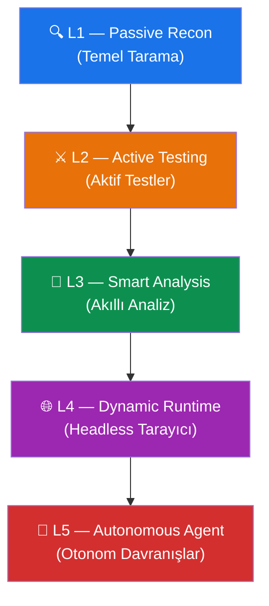
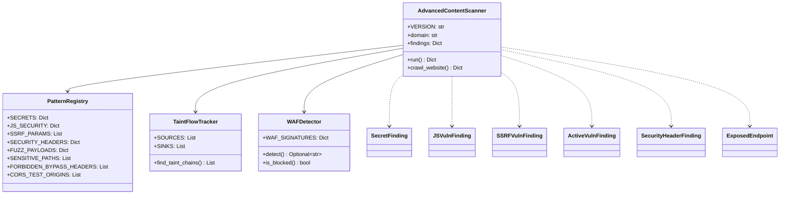

# Advanced Content Scanner v4.0 — Genel Bakış

## Modül Bilgileri

| Özellik | Değer |
|---------|-------|
| **Dosya** | `modules/advanced_content_scanner.py` |
| **Versiyon** | 4.0.0 (Nirvana Edition) |
| **Yazar** | Furkan DINCER (@f3rrkan) |
| **Proje** | Analysis Tool v3.0.0 — Open Source |
| **Toplam Satır** | 2545 |

## Amaç

Advanced Content Scanner, bir web sitesini kapsamlı şekilde güvenlik taramasından geçiren, 5 katmanlı (L1–L5) bir güvenlik analiz modülüdür. Pasif keşiften aktif teste, akıllı analize, headless tarayıcı taramasına ve otonom ajan davranışlarına kadar geniş bir yelpazede çalışır.

## 5 Katmanlı Mimari



### L1 — Pasif Keşif (Passive Recon)
- Concurrent crawl (eş zamanlı tarama)
- Sitemap ve source map keşfi
- JSON blob tarama
- Güvenlik header kontrolü
- JS dosyası işleme ve gizli bilgi tarama
- API endpoint çıkarma
- SSRF parametre tespiti

### L2 — Aktif Test (Active Testing)
- Nuclei entegrasyonu (10.000+ CVE template)
- Aktif fuzzing motoru (SQLi, XSS, SSTI, CRLF, Path Traversal)
- Auth bypass sondajı (403 bypass, header/path tabanlı)
- CORS yanlış yapılandırma testi
- Hassas dosya yolu keşfi

### L3 — Akıllı Bağlam-Duyarlı Analiz
- Taint-flow izleyici (kaynak→hedef JS çağrı zinciri)
- Entropi ağırlıklı gizli bilgi puanlama
- DOM sink numaralandırma
- False positive filtreleme

### L4 — Dinamik Çalışma Zamanı Analizi
- Playwright headless tarayıcı entegrasyonu
- Runtime ağ isteği yakalama
- `window` / `globalThis` gizli bilgi tarama
- SPA rota keşfi
- localStorage / sessionStorage tarama

### L5 — Otonom Ajan Davranışları
- WAF tespiti ve adaptif strateji
- Exploit zinciri oluşturucu
- CVSS tabanlı risk puanlama
- Artımlı diff tarama (durum sakla/yükle)

## Ana Sınıf ve Bileşen Haritası



## Bağımlılıklar

| Paket | Zorunlu | Kullanım Amacı |
|-------|---------|----------------|
| `requests` | ✅ | HTTP istekleri |
| `beautifulsoup4` | ✅ | HTML/XML ayrıştırma |
| `validators` | ✅ | URL doğrulama |
| `playwright` | ❌ (Opsiyonel) | L4 headless tarayıcı |
| `nuclei` (binary) | ❌ (Opsiyonel) | L2 CVE tarama |

## Dosya Dizin Yapısı (Dokümantasyon)

```
docs/detailed-documentation/advanced_content_scanner/
├── 01-genel-bakis.md              ← Bu dosya
├── 02-veri-siniflari.md           ← Data class yapıları
├── 03-pattern-registry.md         ← Desen kayıt defteri
├── 04-crawl-engine.md             ← L1 tarama motoru
├── 05-secret-scanner.md           ← Gizli bilgi tarayıcı
├── 06-js-analysis.md              ← JS güvenlik analizi + Taint
├── 07-ssrf-detection.md           ← SSRF tespit mekanizması
├── 08-active-testing.md           ← L2 aktif testler
├── 09-headless-browser.md         ← L4 Playwright entegrasyonu
├── 10-exploit-chains.md           ← L5 exploit zinciri
├── 11-waf-detection.md            ← WAF tespiti ve adaptasyon
├── 12-utilities-and-helpers.md    ← Yardımcı fonksiyonlar
└── 13-ana-akis.md                 ← run() ana akış şeması
```
