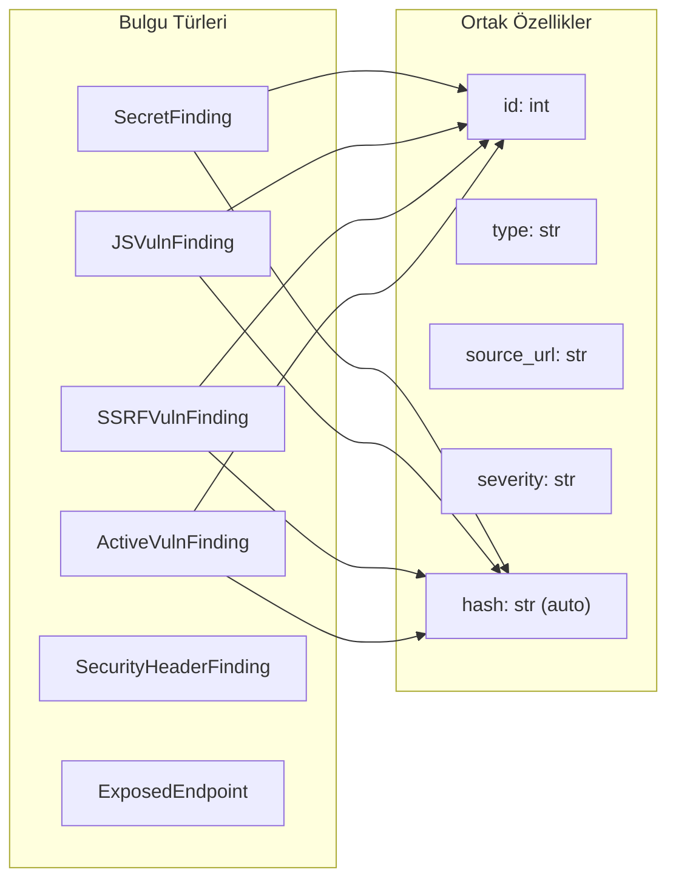
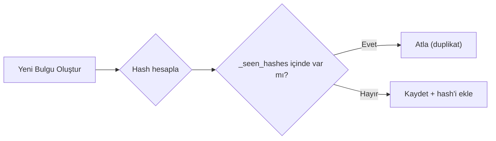

# Veri Sınıfları (Data Classes)

Modül, tespit edilen güvenlik bulgularını yapılandırılmış şekilde saklamak için 6 adet `@dataclass` kullanır. Her bulgu türü ayrı bir veri sınıfıyla temsil edilir.

## Genel Yapı



## 1. SecretFinding (Satır 76-96)

Kaynak kodda veya JS dosyalarında tespit edilen gizli bilgileri (API key, token, parola vb.) saklar.

| Alan | Tip | Açıklama |
|------|-----|----------|
| `id` | `int` | Benzersiz bulgu numarası |
| `type` | `str` | Gizli bilgi türü (ör: "AWS Access Key ID") |
| `source_url` | `str` | Bulunduğu sayfa/dosya URL'si |
| `line` | `int` | Satır numarası |
| `masked_value` | `str` | Maskelenmiş değer (ör: `AKIA****WXYZ`) |
| `raw_length` | `int` | Ham değer uzunluğu |
| `entropy` | `float` | Shannon entropi değeri |
| `context` | `str` | Çevresel bağlam metni |
| `severity` | `str` | Ciddiyet seviyesi (Critical/High/Medium/Low) |
| `confidence` | `str` | Güven seviyesi (HIGH/MEDIUM/LOW) |
| `risk_score` | `float` | CVSS tabanlı risk puanı (0-10) |
| `recommendation` | `str` | Düzeltme önerisi |
| `hash` | `str` | Tekrar önleme hash'i (auto) |

**Hash Hesaplama:**
```python
sha256(f"{type}:{source_url}:{masked_value}") → ilk 16 karakter
```

## 2. JSVulnFinding (Satır 99-120)

JavaScript güvenlik açıklarını (DOM XSS, Open Redirect, Prototype Pollution vb.) saklar.

| Alan | Tip | Açıklama |
|------|-----|----------|
| `id` | `int` | Benzersiz bulgu numarası |
| `type` | `str` | Zafiyet türü (ör: "DOM XSS") |
| `source_url` | `str` | JS dosyası URL'si |
| `line` | `int` | Satır numarası |
| `matched_code` | `str` | Eşleşen zararlı kod parçası |
| `code_context` | `str` | Çevresel kod bağlamı |
| `taint_chain` | `List[str]` | Taint akış zinciri adımları |
| `severity` | `str` | Ciddiyet seviyesi |
| `confidence` | `str` | Güven seviyesi |
| `risk_score` | `float` | Risk puanı (0-10) |
| `description` | `str` | Açıklama |
| `recommendation` | `str` | Düzeltme önerisi |
| `poc` | `str` | Kanıt (Proof of Concept) |
| `hash` | `str` | Tekrar önleme hash'i (auto) |

**Hash Hesaplama:**
```python
sha256(f"{type}:{source_url}:{matched_code}") → ilk 16 karakter
```

## 3. SSRFVulnFinding (Satır 123-144)

Server-Side Request Forgery tespitlerini saklar.

| Alan | Tip | Açıklama |
|------|-----|----------|
| `id` | `int` | Benzersiz bulgu numarası |
| `type` | `str` | SSRF türü (Form Input / URL Parameter / Confirmed) |
| `source_url` | `str` | Tespit edildiği URL |
| `vulnerable_parameters` | `List[str]` | Zafiyet içeren parametre adları |
| `form_action` | `str` | Form action URL'si |
| `method` | `str` | HTTP metodu (get/post) |
| `confirmed` | `bool` | Doğrulanmış mı? |
| `poc` | `str` | Kanıt (Proof of Concept) |
| `severity` | `str` | Ciddiyet seviyesi |
| `confidence` | `str` | Güven seviyesi |
| `risk_score` | `float` | Risk puanı |
| `description` | `str` | Açıklama |
| `recommendation` | `str` | Düzeltme önerisi |
| `hash` | `str` | Tekrar önleme hash'i (auto) |

## 4. ActiveVulnFinding (Satır 147-168)

Aktif testlerle (fuzzing, SSTI, bypass vb.) tespit edilen güvenlik açıklarını saklar.

| Alan | Tip | Açıklama |
|------|-----|----------|
| `id` | `int` | Benzersiz bulgu numarası |
| `type` | `str` | Zafiyet türü (SQLi, XSS, SSTI, CORS vb.) |
| `source_url` | `str` | Test edilen URL |
| `parameter` | `str` | Test edilen parametre |
| `payload` | `str` | Kullanılan payload |
| `evidence` | `str` | Kanıt |
| `severity` | `str` | Ciddiyet seviyesi |
| `confidence` | `str` | Güven seviyesi |
| `risk_score` | `float` | Risk puanı |
| `cvss_vector` | `str` | CVSS vektör dizesi |
| `description` | `str` | Açıklama |
| `recommendation` | `str` | Düzeltme önerisi |
| `poc` | `str` | Kanıt (Proof of Concept) |
| `hash` | `str` | Tekrar önleme hash'i (auto) |

## 5. SecurityHeaderFinding (Satır 171-179)

Eksik veya zayıf güvenlik başlıklarını saklar.

| Alan | Tip | Açıklama |
|------|-----|----------|
| `id` | `int` | Benzersiz bulgu numarası |
| `type` | `str` | Sabit: "Missing/Weak Security Header" |
| `source_url` | `str` | Kontrol edilen URL |
| `header_name` | `str` | Başlık adı (ör: "Content-Security-Policy") |
| `header_value` | `str` | Mevcut değer veya "(not present)" |
| `severity` | `str` | Ciddiyet seviyesi |
| `recommendation` | `str` | Önerilen değer |

> ⚠️ Bu sınıfta `hash` alanı yoktur. Deduplikasyon `_is_new(f"hdr:{origin}")` ile origin bazında yapılır.

## 6. ExposedEndpoint (Satır 182-191)

Hassas ve açık kalması gereken dosya/endpoint'leri saklar.

| Alan | Tip | Açıklama |
|------|-----|----------|
| `id` | `int` | Benzersiz bulgu numarası |
| `url` | `str` | Endpoint URL'si |
| `status_code` | `int` | HTTP durum kodu |
| `content_type` | `str` | Content-Type başlığı |
| `endpoint_type` | `str` | Tür (ör: "Git Exposure", "API Docs") |
| `severity` | `str` | Ciddiyet seviyesi |
| `evidence` | `str` | Kanıt (HTTP kodu + gövde önizleme) |
| `recommendation` | `str` | Düzeltme önerisi |

## Hash Tabanlı Deduplikasyon

Tüm `hash` alanına sahip veri sınıfları `__post_init__` ile otomatik hash üretir. Bu hash, `_seen_hashes` kümesi ile karşılaştırılarak **aynı bulgunun iki kez kaydedilmesi engellenir**.


