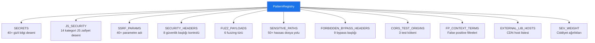

# Pattern Registry — Desen Kayıt Defteri

`PatternRegistry` sınıfı (Satır 198–617), tarayıcının aradığı tüm güvenlik desenlerini, payload'ları ve yapılandırma bilgilerini merkezi bir kayıt defterinde tutar.

## Genel Yapı



---

## 1. SECRETS — Gizli Bilgi Desenleri (Satır 201-350)

40+ regex deseni ile aşağıdaki gizli bilgi türlerini tespit eder:

### Bulut Servis Anahtarları
| Desen Adı | Severity | Min Entropi |
|-----------|----------|-------------|
| AWS Access Key ID | High | 3.2 |
| AWS Secret Access Key | Critical | 4.5 |
| AWS Session Token | Critical | 4.5 |
| Google API Key | High | 4.0 |
| Google OAuth Client Secret | High | 4.2 |
| GCP Service Account Key | Critical | 0 |
| Cloudflare API Token | High | 4.0 |
| DigitalOcean PAT | High | 4.5 |

### AI/ML Servis Anahtarları
| Desen Adı | Severity | Min Entropi |
|-----------|----------|-------------|
| OpenAI API Key | Critical | 4.5 |
| OpenAI API Key (new) | Critical | 4.5 |
| Anthropic API Key | Critical | 4.5 |
| HuggingFace Token | High | 4.0 |
| Replicate API Token | High | 4.0 |

### Ödeme / Finans
| Desen Adı | Severity | Min Entropi |
|-----------|----------|-------------|
| Stripe Secret Key | Critical | 4.0 |
| Stripe Publishable Key | Low | 4.0 |
| PayPal/Braintree Access Token | Critical | 4.5 |

### Versiyon Kontrol / DevOps
| Desen Adı | Severity | Min Entropi |
|-----------|----------|-------------|
| GitHub PAT (classic) | High | 4.5 |
| GitHub Fine-grained PAT | High | 4.5 |
| GitHub OAuth Token | High | 4.5 |
| GitLab PAT | High | 4.0 |
| NPM Auth Token | High | 3.5 |

### İletişim / Mesajlaşma
| Desen Adı | Severity | Min Entropi |
|-----------|----------|-------------|
| Slack Bot/User Token | High | 4.0 |
| Slack Webhook | Medium | 3.5 |
| SendGrid API Key | High | 4.5 |
| Twilio Auth Token | High | 3.5 |
| Mailgun API Key | High | 4.0 |

### Veritabanı Bağlantıları
| Desen Adı | Severity | Min Entropi |
|-----------|----------|-------------|
| MongoDB Connection String | Critical | 3.0 |
| PostgreSQL Connection String | Critical | 3.0 |
| MySQL Connection String | Critical | 3.0 |
| Redis Connection String | High | 2.5 |

### Kriptografi / Kimlik
| Desen Adı | Severity | Min Entropi |
|-----------|----------|-------------|
| SSH/PEM Private Key | Critical | 0 |
| PGP Private Key Block | Critical | 0 |
| JWT Token | Medium | 4.2 |
| Password in URL | High | 3.0 |
| HashiCorp Vault Token | Critical | 4.5 |
| Doppler Token | Critical | 4.5 |
| Generic High-Entropy Secret | High | 5.0 |

### Desen Yapısı

Her gizli bilgi deseni bir dict olarak tanımlanır:

```python
{
    "pattern": r"regex_deseni",      # Arama regex'i
    "min_entropy": 4.5,               # Minimum Shannon entropi eşiği
    "severity": "Critical",           # Ciddiyet seviyesi
    "group": 1                        # Opsiyonel: Regex yakalama grubu
}
```

---

## 2. JS_SECURITY — JavaScript Güvenlik Desenleri (Satır 353-416)

14 kategoride JS güvenlik açığı deseni:

| Kategori | Desen Sayısı | Açıklama |
|----------|-------------|----------|
| DOM XSS | 9 | innerHTML, outerHTML, document.write, eval(atob) vb. |
| Open Redirect | 3 | location.href, location.replace, location.assign |
| Prototype Pollution | 3 | `__proto__`, constructor[prototype] |
| Dynamic Code Execution | 4 | eval(), new Function(), setTimeout(string) |
| Insecure postMessage | 2 | Wildcard origin, message listener |
| Sensitive Data in Client Storage | 3 | localStorage/sessionStorage/cookie |
| WebSocket Plaintext | 1 | ws:// bağlantı |
| Weak / Broken Crypto | 3 | MD5, SHA1, Math.random() |
| Path Traversal | 1 | readFile/sendFile + user input |
| JSONP Callback Injection | 2 | callback parameter |
| Server-Side Request Forgery (JS) | 3 | fetch/axios/XHR + user input |
| Debug / Secret Console Leak | 1 | console.log(password/token) |
| Hardcoded Internal IP | 1 | 10.x.x.x, 172.x.x.x, 192.168.x.x |

---

## 3. SSRF_PARAMS — SSRF Parametre Adları (Satır 419-432)

URL ilişkili 40+ parametre adı listesi:
`url, uri, src, href, target, destination, redirect, redirect_to, redirect_url, load, file, path, image, img, proxy, forward, callback, webhook, feed, content, data, template, preview` vb.

---

## 4. SECURITY_HEADERS — Güvenlik Başlıkları (Satır 435-471)

8 adet güvenlik başlığı kontrol kuralı:

| Başlık | Severity | Doğrulama Kuralı |
|--------|----------|-------------------|
| Strict-Transport-Security | High | max-age ≥ 15768000 |
| Content-Security-Policy | High | default-src var, unsafe-inline/eval yok |
| X-Content-Type-Options | Medium | Değer: "nosniff" |
| X-Frame-Options | Medium | Değer: "DENY" veya "SAMEORIGIN" |
| Referrer-Policy | Low | Herhangi bir değer mevcut |
| Permissions-Policy | Low | Başlık mevcut |
| Cross-Origin-Opener-Policy | Low | "same-origin" veya "same-origin-allow-popups" |
| Cross-Origin-Resource-Policy | Low | "same-origin", "same-site" veya "cross-origin" |

---

## 5. FUZZ_PAYLOADS — Fuzzing Payload'ları (Satır 474-508)

| Tür | Payload Sayısı | Örnekler |
|-----|---------------|----------|
| SQLi | 9 | `' OR '1'='1`, `1' AND SLEEP(2)--`, `' UNION SELECT NULL--` |
| XSS | 8 | `<script>alert(1)</script>`, ``, `{{7*7}}` |
| Path Traversal | 6 | `../etc/passwd`, `..%2Fetc%2Fpasswd` |
| SSTI | 6 | `{{7*7}}`, `${7*7}`, `{{config}}` |
| CRLF | 3 | `%0d%0aSet-Cookie:injected=1` |
| Open Redirect | 5 | `https://evil.com`, `//evil.com` |

---

## 6. SENSITIVE_PATHS — Hassas Dosya Yolları (Satır 511-564)

50+ hassas endpoint kontrol listesi. Kategoriler:

- **Environment Dosyaları**: `.env`, `.env.local`, `.env.production`, `.env.backup`
- **Git/SVN Exposure**: `.git/config`, `.git/HEAD`, `.svn/entries`
- **WordPress**: `wp-config.php.bak`, `wp-config.php~`
- **Yedek Dosyalar**: `backup.zip`, `backup.sql`, `database.sql`, `dump.sql`
- **Debug Endpoint'leri**: `/debug`, `/debug/vars`, `/actuator`, `/actuator/env`
- **API Dokümantasyonu**: `/swagger`, `/swagger-ui.html`, `/api-docs`, `/openapi.json`
- **Sunucu Bilgisi**: `/phpinfo.php`, `/server-status`, `/server-info`
- **Build Dosyaları**: `/package.json`, `/composer.json`, `/requirements.txt`
- **GraphQL**: `/graphql/schema`, `/__graphql`, `/graphiql`

---

## 7. False Positive Filtreleri (Satır 587-613)

### Bağlam Filtreleri (`FP_CONTEXT_TERMS`)
Aşağıdaki terimleri içeren bağlamlardaki bulguları filtreler:
`example, sample, placeholder, dummy, test, demo, your_, INSERT_, REPLACE_, TODO, FIXME, xxx, changeme, enter_your` vb.

### Değer Filtreleri (`FP_VALUE_PATTERNS`)
- 200+ karakter uzunluğundaki tekdüze stringler
- Unicode escape içeren stringler
- Sadece harflerden veya sadece rakamlardan oluşan stringler
- `data:image/` ile başlayan stringler

### Harici Kütüphane Filtreleri (`EXTERNAL_LIB_HOSTS`)
CDN host'larından gelen JS dosyaları taranmaz:
`cdn.jsdelivr.net, cdnjs.cloudflare.com, unpkg.com, ajax.googleapis.com` vb.

---

## 8. Ciddiyet Ağırlıkları (`SEV_WEIGHT`)

Risk puanı hesaplamada kullanılan ağırlıklar:

| Seviye | Ağırlık |
|--------|---------|
| Critical | 10.0 |
| High | 7.5 |
| Medium | 4.0 |
| Low | 1.5 |
| Info | 0.5 |
