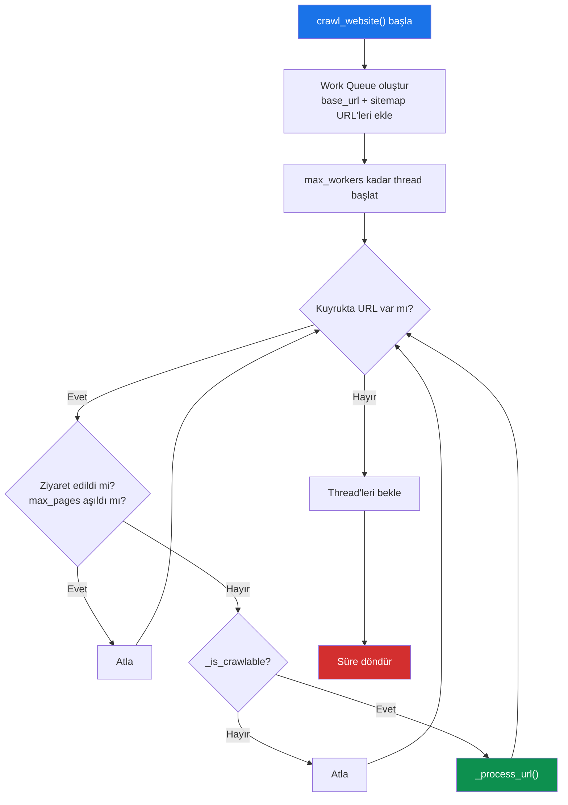
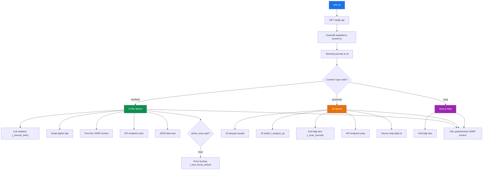
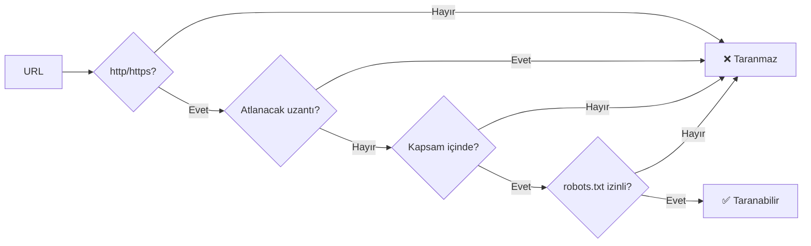
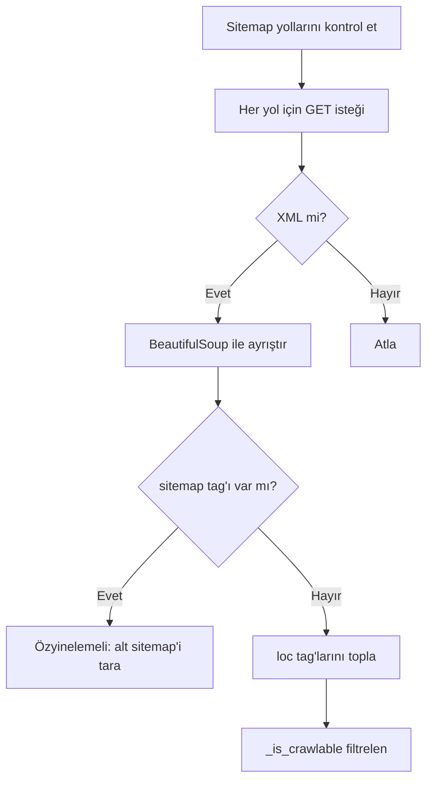
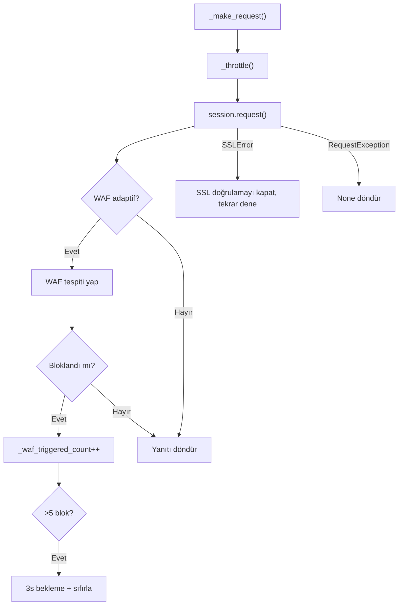

# L1 — Crawl Engine (Tarama Motoru)

Crawl engine, web sitesini eş zamanlı olarak tarayan, sayfaları işleyen ve yeni URL'leri keşfeden ana bileşendir.

## Genel Akış

## `crawl_website()` (Satır 1094-1135)

Ana crawl döngüsü. Eş zamanlı çalışan thread havuzu kullanır.

### Parametreler (init'ten)
- `max_depth`: Maksimum crawl derinliği (varsayılan: 3)
- `max_pages`: Maksimum sayfa sayısı (varsayılan: 200)
- `max_workers`: Eş zamanlı thread sayısı (varsayılan: 15)

### Çalışma Prensibi
1. `queue.Queue()` ile bir iş kuyruğu oluşturulur
2. Base URL ve sitemap URL'leri kuyruğa eklenir
3. `max_workers` kadar daemon thread başlatılır
4. Her thread kuyruktan URL alır ve `_process_url()` ile işler
5. `_shutdown` event'i ile kesme desteği sağlanır

---

## `_process_url()` (Satır 1137-1165)

Her URL için yapılan işlemleri belirler.

---

## `_harvest_links()` (Satır 1171-1191)

HTML sayfasından tüm bağlantıları toplar.

### Kaynak Türleri
| Kaynak | Açıklama |
|--------|----------|
| `<a href=...>` | Standart bağlantılar |
| `data-src` | Lazy-load kaynakları |
| `data-href` | Alternatif bağlantı |
| `<link rel="preload/prefetch/next/prev">` | Performans ipuçları |
| `<meta http-equiv="refresh">` | Yönlendirme meta tag'ları |
| `<form action=...>` | Form hedefleri |

### URL Filtreleme
Toplanan URL'ler şu filtrelerin hepsinden geçer:
- `javascript:`, `#`, `mailto:`, `tel:`, `data:` ile başlayanlar atlanır
- Fragment (#) kaldırılır
- Mutlak URL'ye dönüştürülür
- Daha önce ziyaret edilenler atlanır

---

## `_is_crawlable()` (Satır 1020-1025)

URL'nin taranabilir olup olmadığını 4 koşulla kontrol eder:

### Atlanan Dosya Uzantıları
Resimler (`.jpg`, `.png`, `.gif`, `.svg`...), stiller (`.css`), fontlar (`.woff`, `.ttf`...), medya (`.mp4`, `.mp3`...), arşivler (`.zip`, `.rar`...), dökümanlar (`.doc`, `.pdf`, `.xls`...) taranmaz.

---

## `_in_scope()` (Satır 1005-1010)

URL'nin tarama kapsamında olup olmadığını kontrol eder:
- Aynı netloc → kapsam içi
- `include_subdomains=True` ise aynı root domain'in alt alan adları da dahil

---

## `_collect_sitemap_urls()` (Satır 1197-1223)

Sitemap URL'lerini toplar.

### Kontrol Edilen Yollar
1. `/sitemap.xml`
2. `/sitemap_index.xml`
3. `/sitemaps/sitemap.xml`
4. robots.txt'den bulunan ekstra sitemap'ler

---

## `_follow_source_map()` (Satır 1225-1235)

JS dosyası yanıtından source map URL'ini çıkarır ve kuyruğa ekler.

**Kaynak Sırası:**
1. `X-SourceMap` header
2. `SourceMap` header
3. `//# sourceMappingURL=` satır sonu yorumu

---

## `_process_robots_txt()` (Satır 1037-1056)

robots.txt dosyasını ayrıştırır:
- `Disallow:` kurallarını regex'e dönüştürür → `robots_disallowed` kümesine ekler
- `Sitemap:` URL'lerini `_extra_sitemaps` listesine ekler
- Yalnızca `User-Agent: *` kurallarını dikkate alır

---

## HTTP İstek Yönetimi

### `_build_session()` (Satır 919-940)

Oturum konfigürasyonu:
- **Retry**: 3 deneme, 0.5s backoff, 429/5xx durum kodları
- **Pool**: `max_workers + 5` adet bağlantı havuzu
- **User-Agent**: Chrome 124 taklidi
- **Headers**: Accept, Accept-Language, Accept-Encoding, Connection

### `_throttle()` (Satır 962-968)

Thread bazlı rate limiting:
- Her thread kendi son istek zamanını takip eder
- `rate_limit` süresi kadar bekleme uygular (varsayılan: 0.15s)

### `_make_request()` (Satır 970-999)

Tüm HTTP istekleri bu metottan geçer:

