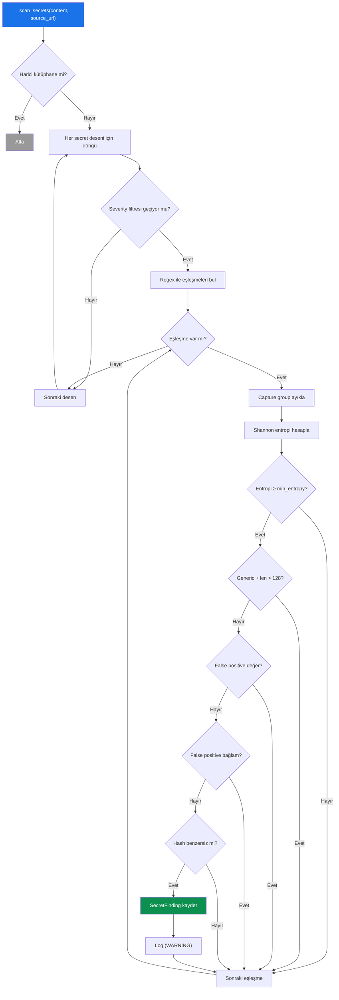
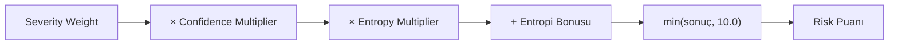
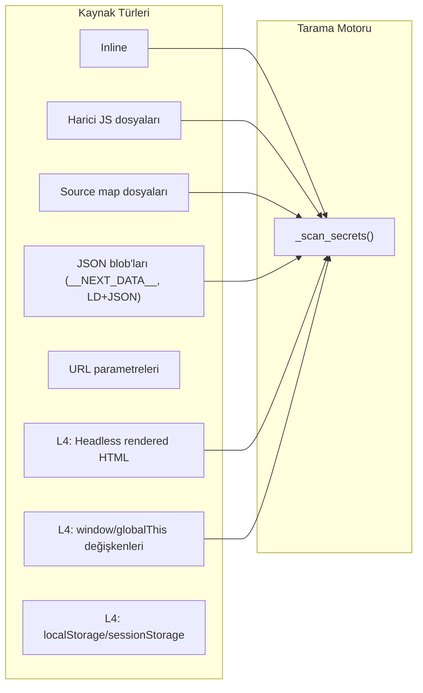

# L1+L3 — Secret Scanner (Gizli Bilgi Tarayıcı)

Gizli bilgi taraması, kaynak kodda ve JS dosyalarında açığa çıkmış API anahtarları, token'lar, parolalar ve bağlantı dizileri gibi hassas bilgileri tespit eder.

## Genel Akış



## `_scan_secrets()` (Satır 1425–1457)

### Adım Adım Çalışma Mantığı

1. **Harici kütüphane kontrolü**: CDN host'larından gelen dosyalar atlanır
2. **Desen eşleştirme**: 40+ regex deseni sırasıyla çalıştırılır
3. **Capture group**: `group` parametresi varsa sadece yakalanan grup alınır
4. **Shannon entropi hesabı**: Rastgelelik ölçümü yapılır
5. **Minimum entropi eşiği**: Her desenin kendine özel eşiği vardır
6. **False positive filtreleri**:
   - `_fp_value()`: Değer bazlı filtre (sadece harf, sadece rakam, çok uzun vb.)
   - `_fp_context()`: Bağlam bazlı filtre (test, example, placeholder vb.)
7. **Güven seviyesi**: Entropi ≥ (min_entropy + 1.0) → HIGH, aksi halde MEDIUM
8. **Deduplikasyon**: Hash ile tekrar kontrolü
9. **Risk puanı**: CVSS-tabanlı bileşik puan hesaplanır

### Güven Seviyesi Belirleme

```python
confidence = "HIGH" if entropy >= min_entropy + 1.0 else "MEDIUM"
```

Örnek: AWS Secret Key deseni min_entropy=4.5:
- Entropi 5.5+ → HIGH güven
- Entropi 4.5–5.5 → MEDIUM güven

---

## Entropi Hesaplama — `_entropy()` (Satır 2222-2228)

Shannon entropi formülü:

```
H(X) = -Σ p(x) × log₂(p(x))
```

```python
@staticmethod
def _entropy(s: str) -> float:
    if not s: return 0.0
    freq = defaultdict(int)
    for c in s: freq[c] += 1
    n = len(s)
    return -sum((v / n) * math.log2(v / n) for v in freq.values())
```

| Giriş | Entropi | Yorum |
|-------|---------|-------|
| `"aaaaaaa"` | 0.0 | Hiç rastgelelik yok |
| `"password"` | ~2.75 | Düşük entropi |
| `"aK4$mX9!qZ2@nR"` | ~3.91 | Orta entropi |
| `"sk-proj-abc123XYZ..."` | ~4.5+ | Yüksek entropi — gerçek anahtar |

---

## Risk Puanı Hesaplama — `_risk_score()` (Satır 1083-1088)

CVSS'ten esinlenilmiş bileşik risk puanı (0–10):

```python
base    = SEV_WEIGHT[severity]         # Critical=10, High=7.5, Medium=4, Low=1.5
conf_m  = {"HIGH": 1.0, "MEDIUM": 0.7, "LOW": 0.4}[confidence]
entr_m  = min(entropy / 5.0, 1.0)     # Entropi çarpanı (entropi varsa)
score   = min(base * conf_m * entr_m + (entr_m * 0.5), 10.0)
```



---

## Maskeleme — `_mask()` (Satır 2230-2233)

Hassas değerleri kullanıcıya gösterirken maskeler:

```python
len ≤ 8  →  ilk 2 + "****"
len > 8   →  ilk 4 + "****" + son 4
```

Örnekler:
- `"sk-abc123xyz789"` → `"sk-a****9789"`
- `"AKIA12"` → `"AK****"`

---

## False Positive Filtreleri

### `_fp_value()` (Satır 2239-2242)

Aşağıdaki kalıplara uyan değerler false positive olarak filtrelenir:

| Regex | Açıklama |
|-------|----------|
| `^[A-Za-z0-9]{200,}$` | 200+ karakter alfanümerik (minified JS) |
| `\\u[0-9a-fA-F]{4}` | Unicode escape dizisi |
| `^[0-9a-f]{32}$` | MD5 hash (32 hex) |
| `^[a-zA-Z]+$` | Sadece harfler |
| `^[0-9]+$` | Sadece rakamlar |
| `data:image/` | Base64 resim verisi |

### `_fp_context()` (Satır 2244-2246)

Çevre bağlamında aşağıdaki terimler varsa filtreler:
`example, sample, placeholder, dummy, test, demo, your_, INSERT_, REPLACE_, TODO, FIXME, xxx, changeme, enter_your, put_your, add_your`

---

## Tarama Kaynakları

Gizli bilgi taraması bu kaynaklar üzerinde çalışır:


