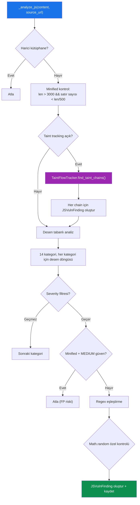
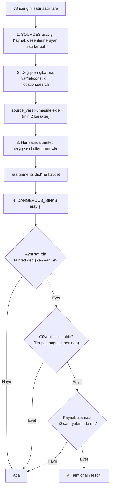
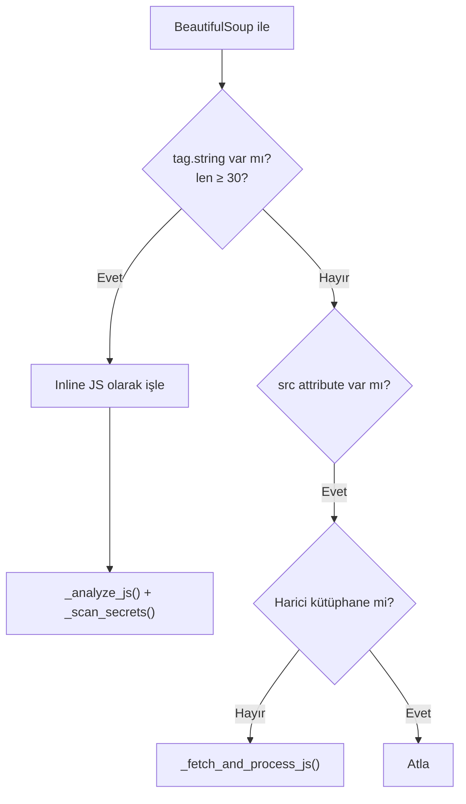

# L1+L3 — JavaScript Güvenlik Analizi ve Taint Flow Tracking

Bu bileşen, JavaScript dosyalarında güvenlik açıklarını tarayan **desen tabanlı analiz** ve kullanıcı kontrollü verilerin tehlikeli hedeflere akışını izleyen **taint-flow izleme** olmak üzere iki katmandan oluşur.

## Genel Akış



---

## `_analyze_js()` (Satır 1345–1408)

### Minified Kod Tespiti

```python
is_minified = len(content) > 3000 and content.count("\n") < max(10, len(content) // 500)
```

Minified dosyalarda yalnızca `HIGH` güvenlikli desenler çalıştırılır (false positive azaltma).

### Math.random() Özel Kuralı

`Math.random()` eşleşmesinde, çevresindeki 60 karakterde **token, secret, key, salt, nonce** kelimelerinden biri yoksa bulgu atlanır. Bu, eriştirilebilir `Math.random()` kullanımlarını (animasyonlar, UI) filtreleri.

### JavaScript Zafiyet Kategorileri ve Seviye Eşlemesi

```python
HIGH_SEVERITY_CATEGORIES = {
    "DOM XSS", "Open Redirect", "Dynamic Code Execution",
    "Prototype Pollution", "WebSocket Plaintext",
    "Weak / Broken Crypto", "Path Traversal",
    "JSONP Callback Injection", "Server-Side Request Forgery (JS)",
    "Debug / Secret Console Leak", "Taint Flow: Source → Sink",
}
# Diğerleri → "Medium"
```

---

## Taint Flow Tracker (Satır 623–729)

### Amaç

Kullanıcı kontrollü **kaynak** (source) verilerinin tehlikeli **hedef** (sink) fonksiyonlara ulaşıp ulaşmadığını izler. Tam AST parser gerektirmez — regex + sezgisel satır bazlı izleme kullanır.

### Kaynak (Source) Desenleri

| Desen | Açıklama |
|-------|----------|
| `location.search/hash/href/pathname` | URL bileşenleri |
| `document.referrer/URL/documentURI/cookie` | Document özellikleri |
| `window.name/location` | Window nesnesi |
| `URLSearchParams().get()` | Parametre okuma |
| `req.query/body/params/headers[]` | Sunucu tarafı parametreler |
| `getParameter()` | Parametre fonksiyonu |
| `localStorage/sessionStorage.getItem()` | Depolama okuma |

### Hedef (Sink) Desenleri — Tehlikeli Sınıf

| Desen | Tehlike Türü |
|-------|-------------|
| `.innerHTML =` | DOM XSS |
| `.outerHTML =` | DOM XSS |
| `document.write()` | DOM XSS |
| `eval()` | Code Injection |
| `new Function()` | Code Injection |
| `dangerouslySetInnerHTML` | React DOM XSS |
| `bypassSecurityTrust` | Angular Bypass |

### Güvenli Hedef Filtreleri

Aşağıdaki kalıplar false positive olarak filtrelenir:
- `Drupal.*`
- `angular.*`
- `.settings.*`
- `console.*`

### Çalışma Mantığı



### Taint Zinciri Çıktısı

```python
{
    "sink_line": 145,                      # Hedef satır numarası
    "sink_pattern": r"\.innerHTML\s*[+]?=", # Eşleşen sink deseni
    "tainted_variable": "userInput",        # Tainted değişken adı
    "source_lines": [132, 140],             # Kaynak satır numaraları
    "sink_code": "el.innerHTML = userInput" # Hedef kod parçası
}
```

### 5 Zorunlu Koşul (Hepsinin Doğru Olması Gerekir)

1. ✅ Değişken, kullanıcı kontrollü bir kaynaktan atanmış olmalı
2. ✅ **Aynı satırda** hem tainted değişken hem tehlikeli sink bulunmalı
3. ✅ Sink gerçekten tehlikeli olmalı (DOM/eval/fetch)
4. ✅ Değişken adı en az 2 karakter olmalı (minified gürültü filtresi)
5. ✅ Güvenli config ataması olmamalı (Drupal.settings vb.)

---

## Inline Script İşleme — `_process_script_tags()` (Satır 1312-1326)



---

## JS Dosyası İşleme — `_fetch_and_process_js()` (Satır 1328-1339)

1. Thread-safe kontrol: zaten indirilmiş mi?
2. GET isteği ile dosyayı indir
3. İçerik 30 karakterden kısa ise atla
4. `_analyze_js()`, `_scan_secrets()`, `_extract_api_endpoints()` çalıştır

---

## API Endpoint Çıkarma — `_extract_api_endpoints()` (Satır 1463-1508)

### Algılanan Kalıplar

| Regex | Açıklama |
|-------|----------|
| `/api/v\d+/...` | Versiyonlu API yolları |
| `/api/...` | Genel API yolları |
| `/graphql` | GraphQL endpoint |
| `/rest/v\d+/...` | REST API yolları |
| `/ajax/...` | AJAX yolları |
| `/wp-json/...` | WordPress REST API |
| `"https://..."` | JS içindeki tam URL'ler |

### GraphQL İntrospection Testi

GraphQL endpoint'i tespit edildiğinde otomatik olarak introspection sorgusu gönderilir:

```json
{"query": "{__schema{queryType{name}}}"}
```

200 yanıtı + `__schema` içeriyorsa → **"GraphQL Introspection Enabled"** bulgusu oluşturulur.
