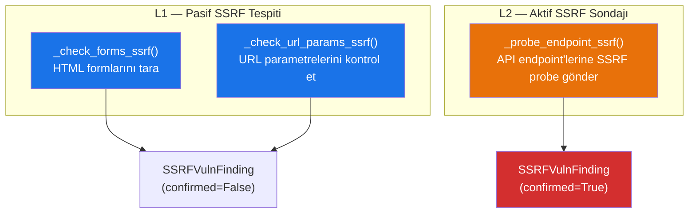
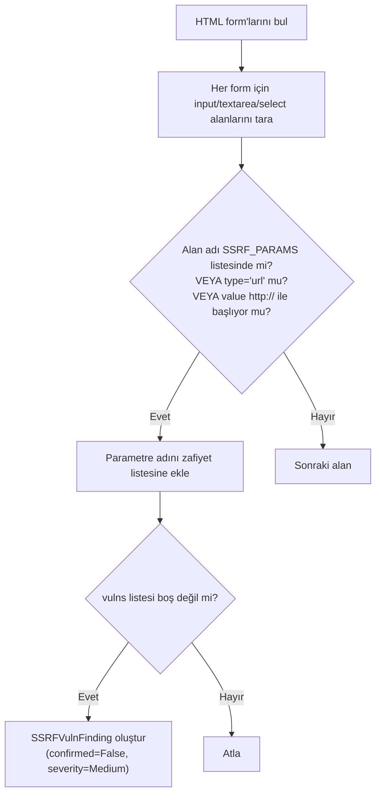
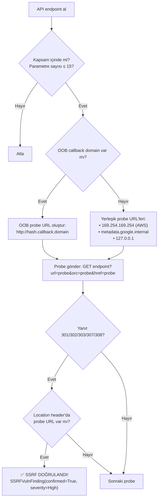

# SSRF Tespit Mekanizması

Server-Side Request Forgery (SSRF) tespiti, **pasif form analizi**, **URL parametre kontrolü** ve **aktif endpoint sondajı** olmak üzere 3 katmandan oluşur.

## Genel Akış



---

## 1. Form Tabanlı SSRF — `_check_forms_ssrf()` (Satır 1514-1558)

HTML sayfalarındaki formları tarayarak SSRF riskli parametreleri tespit eder.



### Tespit Koşulları (herhangi biri)

| Koşul | Açıklama |
|-------|----------|
| Parametre adı SSRF listesinde | `url, redirect, image, proxy, callback...` |
| Input type = "url" | HTML5 URL alanı |
| Değer/placeholder http:// ile başlıyor | URL içeren varsayılan değer |

---

## 2. URL Parametre SSRF — `_check_url_params_ssrf()` (Satır 1543-1558)

Ziyaret edilen URL'lerin query parametrelerini kontrol eder:

```python
params = parse_qsl(urlparse(url).query)
vulns = [k for k in params if any(p in k.lower() for p in SSRF_PARAMS)]
```

Eşleşme varsa → `SSRFVulnFinding(confirmed=False, severity=Medium)` kaydedilir.

---

## 3. Aktif SSRF Sondajı — `_probe_endpoint_ssrf()` (Satır 1560-1597)

API endpoint'lerine gerçek SSRF payload'ları gönderir ve yanıtları analiz eder.



### Aktif Probe Detayları

**OOB (Out-of-Band) Callback:**
- `oob_callback_domain` parametre olarak verilebilir
- Her endpoint için benzersiz hash üretilir
- Probe URL: `http://{hash}.{callback_domain}`

**Yerleşik Probeler:**
| URL | Amaç |
|-----|------|
| `http://169.254.169.254/latest/meta-data/` | AWS IMDSv1 metadata |
| `http://metadata.google.internal/computeMetadata/v1/` | GCP metadata |
| `http://127.0.0.1:80` | Localhost erişim testi |

### Doğrulama Kriteri

SSRF, yalnızca sunucu yanıtındaki `Location` header'ında probe URL'si yer aldığında **doğrulanmış** (confirmed) olarak işaretlenir.

---

## SSRF Parametre Listesi (40+ Parametre)

```
url, uri, src, href, target, destination,
redirect, redirect_to, redirect_url, redirect_uri,
return, return_to, return_url, next, continue, goto,
load, file, path, filepath, filename,
image, img, image_url, avatar, thumbnail, photo,
document, doc, document_url, asset,
fetch, download, resource, endpoint, api_endpoint,
proxy, forward, origin, host, domain, site,
callback, callback_url, webhook, webhook_url,
feed, rss, content, data, html, template,
media, video, audio, stream, link,
report, export, import, preview
```

---

## Bulgu Çıktı Karşılaştırması

| Alan | Pasif (Form/URL) | Aktif (Probe) |
|------|-------------------|---------------|
| `confirmed` | `False` | `True` |
| `severity` | Medium | High |
| `confidence` | MEDIUM | HIGH |
| `type` | "Potential SSRF — Form Input" | "Confirmed SSRF — API Redirect" |
| `evidence` | Parametre adı | Redirect Location header |
