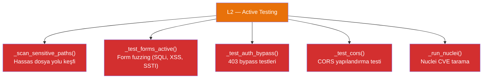
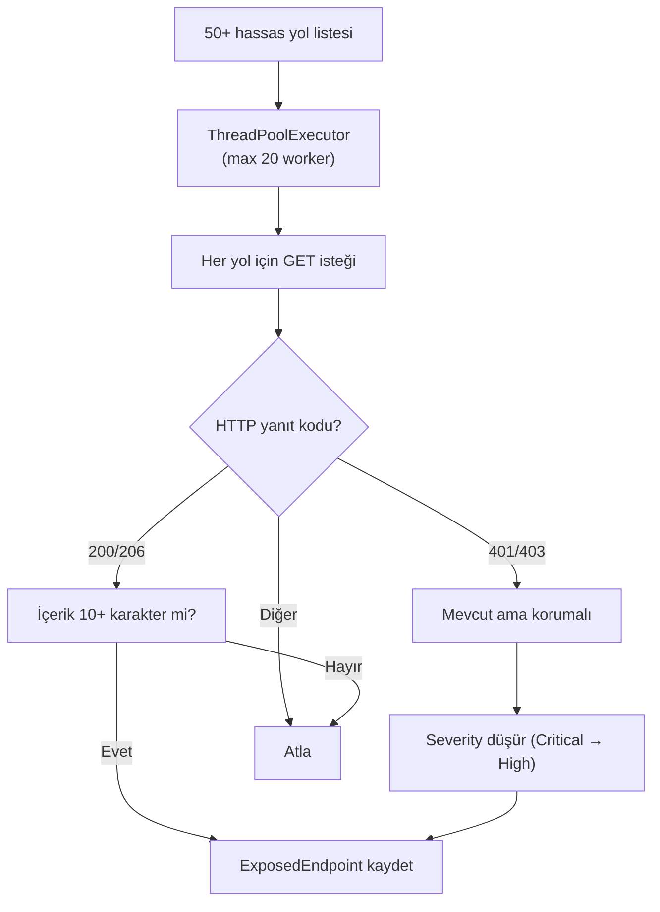
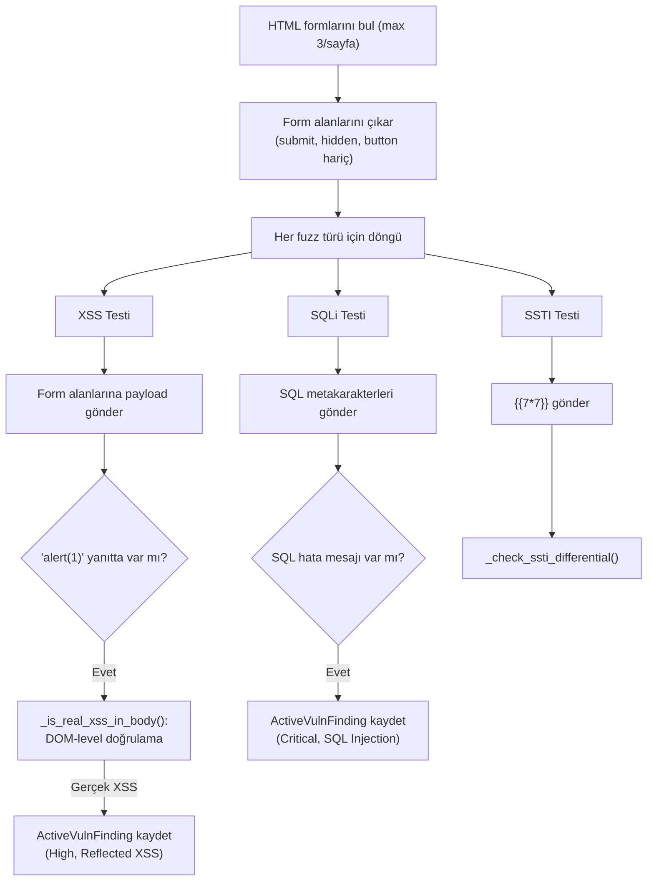
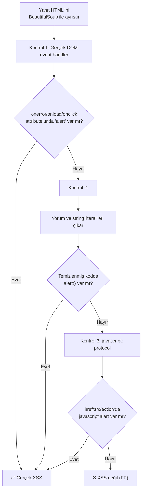
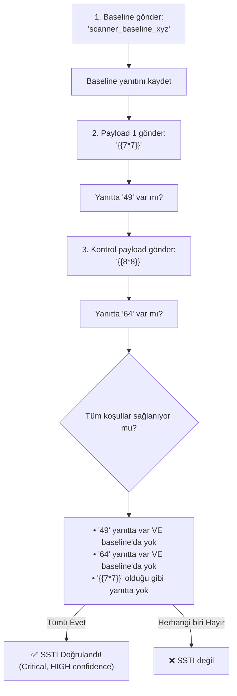
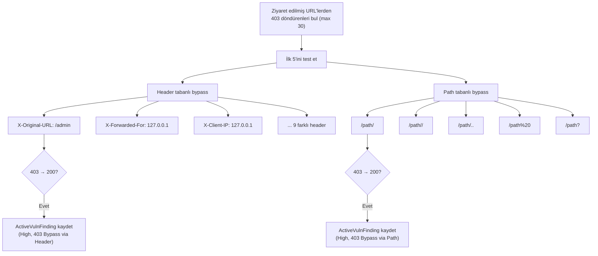
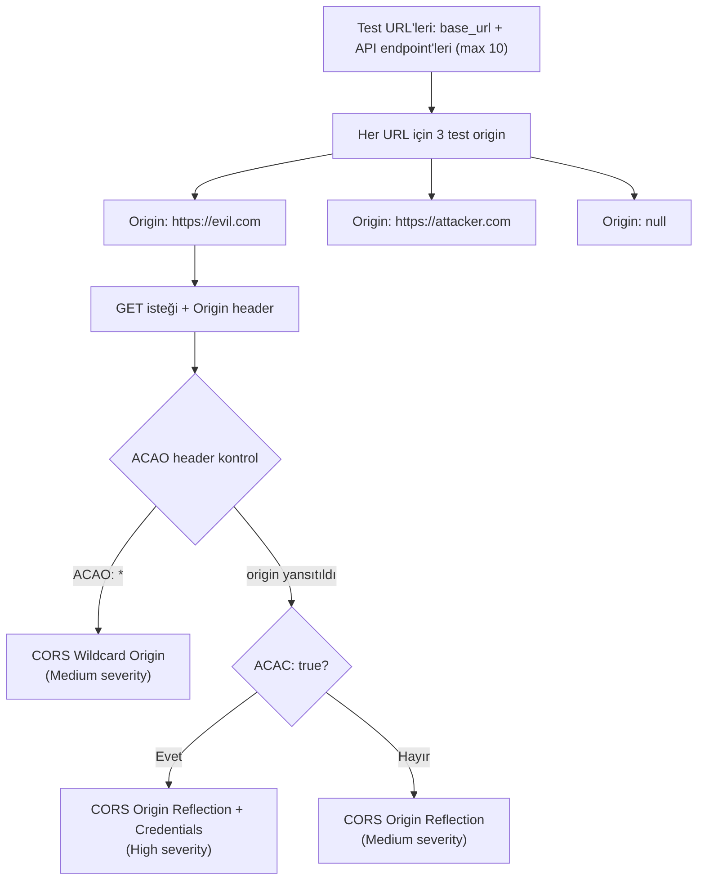
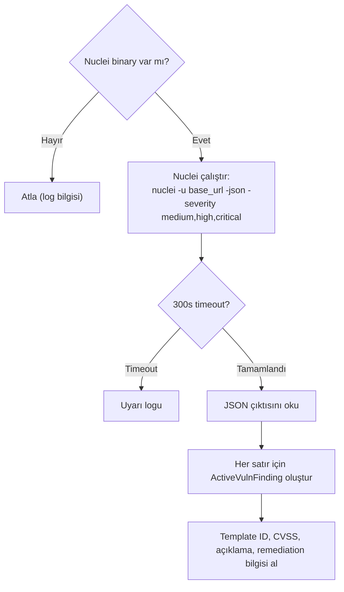

# L2 — Active Testing (Aktif Güvenlik Testleri)

L2 katmanı, hedef siteye aktif olarak payload gönderen, yanıtları analiz eden ve güvenlik açıklarını doğrulayan bileşenleri içerir.

## L2 Bileşenleri



---

## 1. Hassas Dosya Yolu Keşfi — `_scan_sensitive_paths()` (Satır 1603–1635)

50+ hassas yolu paralel Thread havuzu ile tarar.



### Kontrol Edilen Yol Kategorileri

| Kategori | Örnekler | Severity |
|----------|----------|----------|
| Environment | `.env`, `.env.production` | Critical |
| Git/SVN | `.git/config`, `.svn/entries` | Critical–High |
| Veritabanı Yedekleri | `backup.sql`, `dump.sql` | Critical |
| Debug Endpoint | `/debug`, `/actuator/env` | High–Critical |
| API Dokümantasyon | `/swagger`, `/openapi.json` | Medium |
| Sunucu Bilgisi | `/phpinfo.php`, `/server-status` | High–Medium |
| Parola Dosyaları | `.htpasswd` | Critical |

---

## 2. Form Fuzzing — `_test_forms_active()` (Satır 1641–1718)

Her sayfadaki formları 3 farklı payload türüyle test eder.



### XSS Doğrulama — `_is_real_xss_in_body()` (Satır 1720–1767)

3 aşamalı DOM-seviye XSS doğrulaması:



> **Önemli**: Bu yöntem, `` gibi payload'ların HTML-encode edilmiş halde geri döndüğü durumları doğru şekilde filtreler.

### SQLi Hata Tespiti

Aşağıdaki SQL hata mesajları aranır:
```
sql syntax, mysql_fetch, ora-01756, microsoft ole db,
unclosed quotation, pg_query, sqlite_, syntax error,
division by zero, invalid query
```

### SSTI Diferansiyel Testi — `_check_ssti_differential()` (Satır 1769–1819)

3 adımlı güvenilir SSTI tespiti:



---

## 3. Auth Bypass — `_test_auth_bypass()` (Satır 1840–1895)

403 yanıt döndüren sayfalarda bypass denemeleri yapar.



### Bypass Header'ları

| Header | Değer |
|--------|-------|
| `X-Original-URL` | `/admin` |
| `X-Rewrite-URL` | `/admin` |
| `X-Custom-IP-Authorization` | `127.0.0.1` |
| `X-Forwarded-For` | `127.0.0.1` |
| `X-Forward-For` | `127.0.0.1` |
| `X-Remote-IP` | `127.0.0.1` |
| `X-Originating-IP` | `127.0.0.1` |
| `X-Remote-Addr` | `127.0.0.1` |
| `X-Client-IP` | `127.0.0.1` |

---

## 4. CORS Testi — `_test_cors()` (Satır 1901–1939)

CORS yapılandırma hataları için aktif sondaj yapar.



### Test Origin'leri
- `https://evil.com`
- `https://attacker.com`
- `null`

### Kontrol Edilen Header'lar
- `Access-Control-Allow-Origin` (ACAO)
- `Access-Control-Allow-Credentials` (ACAC)

---

## 5. Nuclei Entegrasyonu — `_run_nuclei()` (Satır 1945–1987)

Harici Nuclei binary'sini çalıştırarak 10.000+ CVE template ile tarar.



### Nuclei Komut Parametreleri

```bash
nuclei -u <base_url> \
  -json \
  -o <output_dir>/nuclei_output.json \
  -severity medium,high,critical \
  -timeout 10 \
  -retries 1 \
  -rate-limit 30 \
  -silent
```
