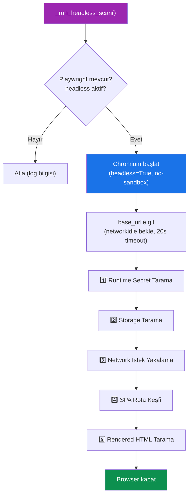
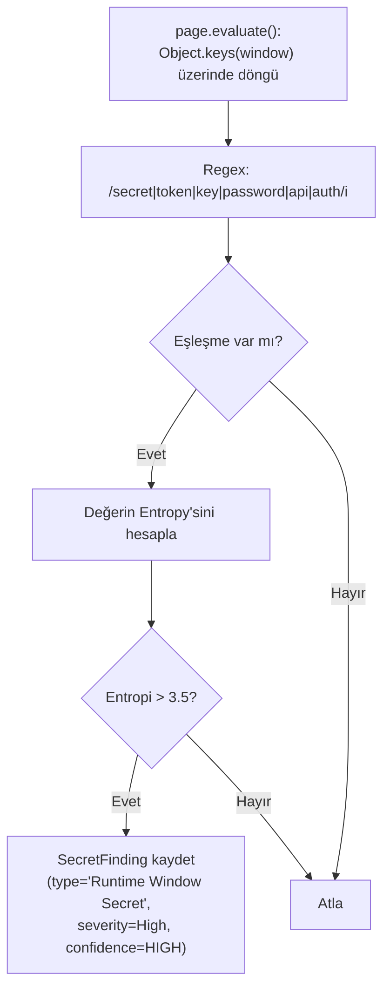
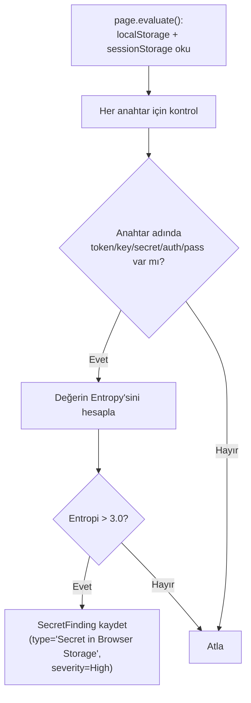
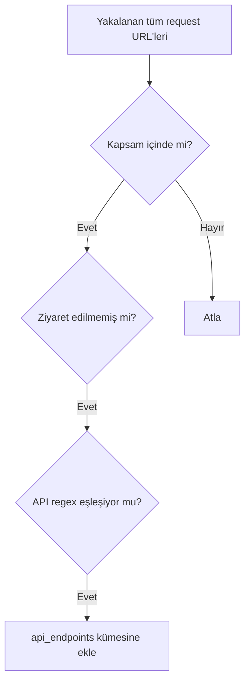
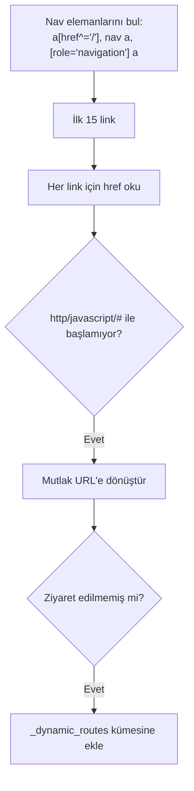
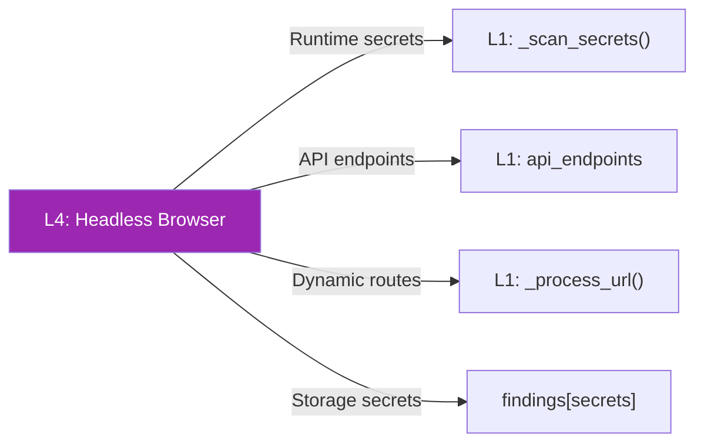

# L4 — Headless Browser (Playwright Entegrasyonu)

L4 katmanı, Playwright headless tarayıcısı kullanarak çalışma zamanı (runtime) analizi yapar. Statik analizin kaçırdığı dinamik içerikleri, SPA rotalarını ve runtime gizli bilgileri tespit eder.

## Ön Koşullar

| Gereksinim | Durum |
|------------|-------|
| `playwright` Python paketi | Opsiyonel (graceful fallback) |
| Chromium binary | `playwright install chromium` |
| `headless=True` parametresi | Scanner init'te aktif edilmeli |

```python
# Opsiyonel import — kurulu değilse PLAYWRIGHT_AVAILABLE = False
try:
    from playwright.sync_api import sync_playwright, TimeoutError as PWTimeout
    PLAYWRIGHT_AVAILABLE = True
except ImportError:
    PLAYWRIGHT_AVAILABLE = False
```

---

## Genel Akış



---

## 1️⃣ Runtime Secret Tarama — `window` / `globalThis`

Tarayıcı bağlamında JavaScript çalıştırarak `window` nesnesindeki hassas değişkenleri tarar.



### JavaScript Kodu (Tarayıcıda Çalışır)

```javascript
() => {
    const keys = [];
    const sensitive = /secret|token|key|password|api|auth/i;
    try {
        for (const k of Object.keys(window)) {
            if (sensitive.test(k))
                keys.push({key: k, val: String(window[k]).slice(0,100)});
        }
    } catch(e) {}
    return keys;
}
```

---

## 2️⃣ Storage Tarama — localStorage / sessionStorage



**Öneri:** `"Store tokens in HttpOnly cookies, not Web Storage."`

---

## 3️⃣ Network İstek Yakalama

Sayfa yüklenirken yapılan tüm HTTP istekleri kaydedilir:

```python
captured_requests: List[str] = []
page.on("request", lambda req: captured_requests.append(req.url))
```



Bu sayede lazy-loaded API çağrıları, AJAX istekleri ve üçüncü taraf servis bağlantıları tespit edilir.

---

## 4️⃣ SPA Rota Keşfi

Navigasyon bağlantılarına tıklayarak SPA (Single Page Application) rotalarını keşfeder:



> **Not:** Keşfedilen dinamik rotalar, daha sonra `_process_url()` ile tek tek işlenir (ana `run()` akışında).

---

## 5️⃣ Rendered HTML Tarama

Playwright ile render edilen HTML, statik HTML'den farklı olabilir (React, Vue, Angular uygulamaları). Bu nedenle render edilmiş HTML de gizli bilgi taramasından geçirilir:

```python
html = page.content()
self._scan_secrets(html, f"{self.base_url}#headless-rendered")
```

---

## Hata Yönetimi

| Hata Türü | Davranış |
|-----------|----------|
| `PWTimeout` (Playwright Timeout) | Uyarı logu, tarama devam eder |
| Genel `Exception` | Hata logu, tarama devam eder |
| `ImportError` (Playwright yok) | `PLAYWRIGHT_AVAILABLE = False`, L4 tamamen atlanır |

---

## L4'ün Diğer Katmanlarla Entegrasyonu


