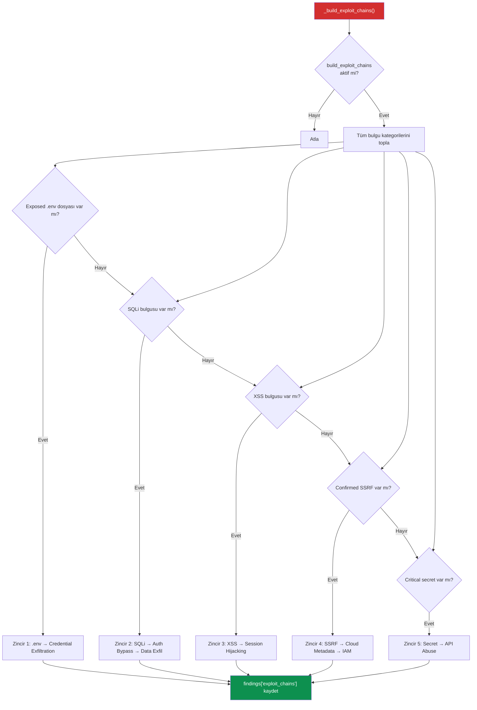
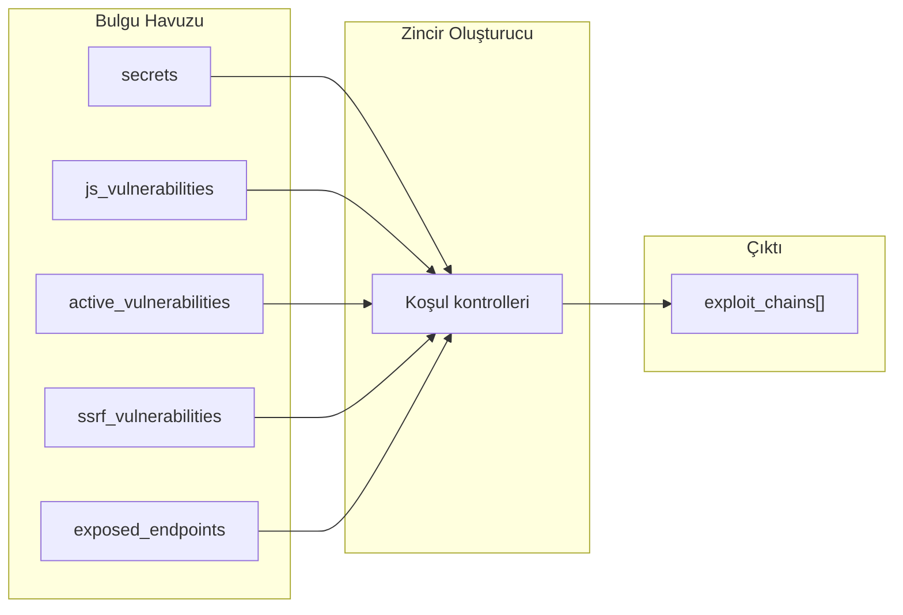

# L5 — Exploit Chain Builder (Exploit Zinciri Oluşturucu)

L5 katmanının exploit zinciri oluşturucu bileşeni, tarama sırasında bulunan bağımsız güvenlik bulgularını birbiriyle ilişkilendirerek **saldırı senaryoları (attack narratives)** oluşturur.

## Amaç

Tek başına Medium seviyeli bir bulgu, bir saldırı zincirinin parçası olduğunda Critical seviyeye yükselebilir. Bu bileşen, bulguları saldırı perspektifinden analiz ederek gerçekçi tehdit senaryoları oluşturur.

---

## Genel Akış



---

## Exploit Zincirleri

### Zincir 1: Exposed .env → Direct Credential Exfiltration

**Tetikleyici:** `exposed_endpoints` içinde `.env` dosyası + HTTP 200

| Adım | Açıklama |
|------|----------|
| 1 | `.env` dosyasına erişim |
| 2 | Veritabanı credential'ları, API key'leri ve secret key'leri çıkar |
| 3 | Credential'lar ile veritabanı/API servislerine kimlik doğrulama |
| 4 | Tam uygulama ele geçirme |

- **Severity:** Critical
- **Risk Score:** 10.0
- **MITRE ATT&CK:** T1552.001 — Credentials in Files

---

### Zincir 2: SQL Injection → Authentication Bypass → Data Exfiltration

**Tetikleyici:** `active_vulnerabilities` içinde "SQL Injection" türü

| Adım | Açıklama |
|------|----------|
| 1 | SQL payload enjekte et |
| 2 | `' OR '1'='1` ile kimlik doğrulamayı atla |
| 3 | UNION-based injection ile kullanıcı tablosunu dump et |
| 4 | Hash'li parolaları kır veya düz metin credential'ları kullan |

- **Severity:** Critical
- **Risk Score:** 9.8
- **MITRE ATT&CK:** T1190 — Exploit Public-Facing Application

---

### Zincir 3: Reflected XSS → Session Token Theft → Account Takeover

**Tetikleyici:** `active_vulnerabilities` içinde "XSS" türü

| Adım | Açıklama |
|------|----------|
| 1 | XSS payload'ı hazırla |
| 2 | Sosyal mühendislik ile kurbanı zararlı linke yönlendir |
| 3 | XSS payload'ı `document.cookie`'yi saldırgan sunucusuna gönderir |
| 4 | Saldırgan session token ile hesabı ele geçirir |

- **Severity:** High
- **Risk Score:** 8.5
- **MITRE ATT&CK:** T1185 — Browser Session Hijacking

---

### Zincir 4: Confirmed SSRF → Cloud Metadata → IAM Credential Theft

**Tetikleyici:** `ssrf_vulnerabilities` içinde `confirmed=True`

| Adım | Açıklama |
|------|----------|
| 1 | SSRF ile cloud metadata endpoint'ine erişim |
| 2 | `http://169.254.169.254/latest/meta-data/iam/security-credentials/` fetch |
| 3 | Geçici AWS credential'ları çıkar (AccessKeyId, SecretAccessKey, Token) |
| 4 | S3 bucket'larına erişim, IAM role numaralandırma, yetki yükseltme |

- **Severity:** Critical
- **Risk Score:** 9.5
- **MITRE ATT&CK:** T1552.005 — Cloud Instance Metadata API

---

### Zincir 5: Exposed Secret → Direct API Service Abuse

**Tetikleyici:** `secrets` içinde `severity=Critical`

| Adım | Açıklama |
|------|----------|
| 1 | Kaynak koddan secret'i çıkar |
| 2 | Masked değer ve entropi bilgisi ile doğrula |
| 3 | Secret ile doğrudan servis API'sine kimlik doğrulama |
| 4 | Servisi kötüye kullanım (inference, e-posta, veri erişimi) |

- **Severity:** Critical
- **Risk Score:** 9.0
- **MITRE ATT&CK:** T1552.001 — Credentials in Files

---

## Zincir Veri Yapısı

Her exploit zinciri aşağıdaki yapıya sahiptir:

```python
{
    "id": 1,                                    # Zincir numarası
    "title": "Exposed .env → Direct ...",       # Başlık
    "severity": "Critical",                     # Ciddiyet
    "risk_score": 10.0,                         # Risk puanı
    "steps": [                                  # Adımlar listesi
        "1. Access /.env",
        "2. Extract credentials...",
    ],
    "mitre": "T1552.001 — Credentials in Files", # MITRE ATT&CK referansı
    "poc": "curl -s https://example.com/.env",   # Proof of Concept
    "recommendation": "Immediately restrict...",  # Düzeltme önerisi
}
```

---

## Zincir Oluşturma Akışı (Özet)


