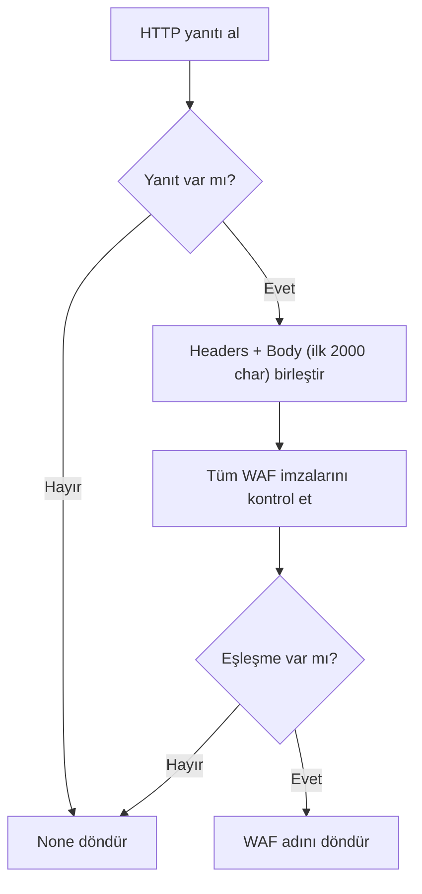
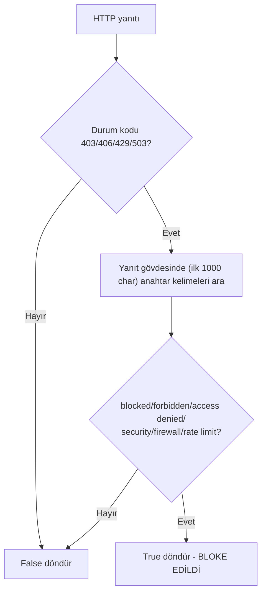
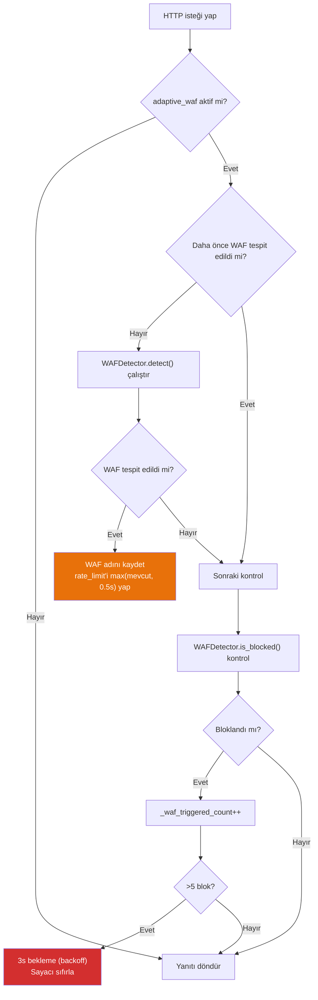

# L5 — WAF Detection & Adaptive Strategy (WAF Tespiti ve Adaptif Strateji)

`WAFDetector` sınıfı ve `_make_request()` içindeki adaptif mekanizma, hedef sitenin WAF (Web Application Firewall) koruması altında olup olmadığını tespit eder ve tarama stratejisini otomatik olarak ayarlar.

---

## WAFDetector Sınıfı (Satır 736–770)

### WAF İmza Veritabanı

| WAF Markası | Tespit İmzaları |
|-------------|----------------|
| **Cloudflare** | `cf-ray`, `cloudflare`, `__cfduid`, `cf_clearance` |
| **Akamai** | `akamai`, `akamaighost`, `x-akamai` |
| **Imperva** | `x-iinfo`, `x-cdn`, `incap_ses`, `visid_incap` |
| **AWS WAF** | `x-amzn-requestid`, `x-amz-cf-id` |
| **Sucuri** | `x-sucuri-id`, `x-sucuri-cache` |
| **F5 BIG-IP** | `bigipserver`, `f5-bigip` |
| **Barracuda** | `barra_counter_session` |
| **Fortinet** | `fortigate`, `fortiweb` |
| **ModSecurity** | `mod_security`, `modsecurity` |

### `detect()` Metodu



### `is_blocked()` Metodu

İsteğin WAF tarafından engellenip engellenmediğini tespit eder:



---

## Adaptif Strateji — `_make_request()` İçi (Satır 970–999)

Her HTTP isteğinden sonra WAF adaptif mekanizması çalışır:



### Adaptif Strateji Detayları

| Olay | Aksiyon |
|------|--------|
| İlk WAF tespiti | Rate limit ≥ 0.5s'ye yükselt, log bil |
| 1-5 blok tespiti | Sayacı artır, devam et |
| 5+ blok tespiti | 3s hard backoff, sayacı sıfırla |
| SSL Hatası | SSL doğrulamayı kapatıp tekrar dene |

### Rate Limit Yönetimi

```python
# Normal durum: varsayılan rate_limit = 0.15s
# WAF tespiti sonrası:
self.rate_limit = max(self.rate_limit, 0.5)  # En az 0.5s

# Thread bazlı throttle:
def _throttle(self):
    tid = threading.get_ident()
    now = time.monotonic()
    wait = self.rate_limit - (now - self._last_req_times.get(tid, 0))
    if wait > 0:
        time.sleep(wait)
    self._last_req_times[tid] = time.monotonic()
```

---

## WAF Tespiti Sonuçları

Tespit edilen WAF bilgisi şu yerlerde kullanılır:

1. **Tarama sırasında**: Rate limit otomatik artırılır
2. **Özet raporda**: `detected_waf` alanında gösterilir
3. **Bulgu yorumlamada**: WAF ile korunan hedeflerde false negative olasılığı not edilir

```python
# Özet rapor çıktısı
{
    "detected_waf": "Cloudflare",
    # veya
    "detected_waf": "None",
}
```
