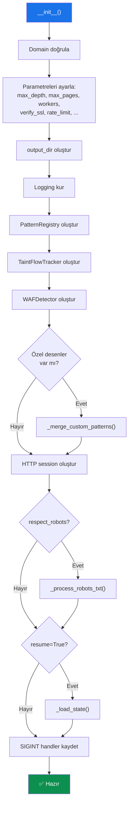

# Ana Akış — `run()` Metodu

`run()` metodu (Satır 2443-2484), tüm tarama katmanlarını sırasıyla çalıştıran ana giriş noktasıdır. L1'den L5'e kadar her katman kontrollü şekilde tetiklenir.

---

## Tam Akış Şeması

```mermaid
flowchart TD
    START["🚀 run() başla"] --> L1["━━ L1: Passive Recon ━━"]
    
    L1 --> CRAWL["crawl_website()<br/>• Sitemap URL'leri topla<br/>• Thread havuzu ile crawl<br/>• Her sayfa: headers, tech, links, JS, SSRF"]
    
    CRAWL --> L2_CHECK{"active_scan<br/>aktif mi?"}
    
    L2_CHECK -- Evet --> L2["━━ L2: Active Testing ━━"]
    L2 --> L2_SP["_scan_sensitive_paths()<br/>50+ hassas yol tara"]
    L2_SP --> L2_CORS["_test_cors()<br/>CORS yapılandırma testi"]
    L2_CORS --> L2_AUTH["_test_auth_bypass()<br/>403 bypass denemeleri"]
    L2_AUTH --> L2_NUCLEI["_run_nuclei()<br/>CVE template tarama"]
    
    L2_CHECK -- Hayır --> API_CHECK
    L2_NUCLEI --> API_CHECK
    
    API_CHECK{"API endpoint'leri<br/>var mı?"} -- Evet --> SSRF_PROBE["L1: _probe_endpoint_ssrf()<br/>ThreadPoolExecutor ile<br/>tüm endpoint'leri SSRF sondajı"]
    API_CHECK -- Hayır --> L4_CHECK
    SSRF_PROBE --> L4_CHECK
    
    L4_CHECK{"headless<br/>aktif mi?"} -- Evet --> L4["━━ L4: Headless Browser ━━"]
    L4 --> L4_SCAN["_run_headless_scan()<br/>• Runtime secrets (window)<br/>• Storage tarama<br/>• Network yakalama<br/>• SPA rota keşfi"]
    L4_SCAN --> L4_DYN["Dinamik rotaları işle:<br/>_process_url() her route için"]
    
    L4_CHECK -- Hayır --> L5
    L4_DYN --> L5
    
    L5["━━ L5: Autonomous Agent ━━"] --> L5_CHAINS["_build_exploit_chains()<br/>Bulguları saldırı zincirleri olarak birleştir"]
    
    L5_CHAINS --> FINAL["━━ Sonuçlandırma ━━"]
    FINAL --> SUMMARY["_build_summary(duration)<br/>Tüm istatistikleri hesapla"]
    SUMMARY --> SAVE["_save_findings()<br/>JSON dosyasına kaydet"]
    SAVE --> STATE["_save_state()<br/>Durumu kaydet (resume için)"]
    STATE --> LOG["_log_summary()<br/>Konsola özet bas"]
    LOG --> RETURN["findings dict döndür"]

    START -.-> ERROR["Exception yakala<br/>traceback + findings[error] döndür"]

    style START fill:#1a73e8,color:#fff
    style L1 fill:#1a73e8,color:#fff
    style L2 fill:#e8710a,color:#fff
    style L4 fill:#9c27b0,color:#fff
    style L5 fill:#d32f2f,color:#fff
    style FINAL fill:#0d904f,color:#fff
    style RETURN fill:#0d904f,color:#fff
```



---

## Çalışma Sıralaması

| Sıra | Katman | Metot | Açıklama | Koşul |
|------|--------|-------|----------|-------|
| 1 | L1 | `crawl_website()` | Pasif crawl + JS/secret/header analizi | Her zaman |
| 2 | L2 | `_scan_sensitive_paths()` | Hassas dosya yolu keşfi | `active_scan=True` |
| 3 | L2 | `_test_cors()` | CORS yapılandırma testi | `active_scan=True` + `test_cors=True` |
| 4 | L2 | `_test_auth_bypass()` | 403 bypass denemeleri | `active_scan=True` + `test_auth_bypass=True` |
| 5 | L2 | `_run_nuclei()` | Nuclei CVE tarama | `active_scan=True` + nuclei binary mevcut |
| 6 | L1 | `_probe_endpoint_ssrf()` | API endpoint SSRF sondajı | `api_endpoints` boş değil |
| 7 | L4 | `_run_headless_scan()` | Playwright headless tarama | `headless=True` + Playwright mevcut |
| 8 | L1 | Dinamik rota işleme | Headless'tan keşfedilen rotaları tara | `_dynamic_routes` boş değil |
| 9 | L5 | `_build_exploit_chains()` | Exploit zincirleri oluştur | `build_exploit_chains=True` |
| 10 | — | `_build_summary()` | Özet rapor | Her zaman |
| 11 | — | `_save_findings()` | JSON'a kaydet | Her zaman |
| 12 | — | `_save_state()` | Durumu kaydet | Her zaman |
| 13 | — | `_log_summary()` | Konsol çıktısı | Her zaman |

---

## L3 Entegrasyonu

> **Not:** L3 (Smart Analysis) ayrı bir çalışma adımı olarak değil, L1 crawl sırasında entegre şekilde çalışır:
> - **Taint Flow Tracking** → `_analyze_js()` içinde (her JS dosyası işlenirken)
> - **Entropi bazlı puanlama** → `_scan_secrets()` içinde (her secret taranırken)
> - **False positive filtreleme** → `_fp_value()` ve `_fp_context()` ile

---

## Çıktı Dosyası Formatı

```
{output_dir}/scan_{domain}_{timestamp}.json
```

Örnek: `results/example.com/scan_example.com_20260324-161500.json`

### JSON Yapısı

```json
{
    "secrets": [...],
    "js_vulnerabilities": [...],
    "ssrf_vulnerabilities": [...],
    "active_vulnerabilities": [...],
    "security_headers": [...],
    "exposed_endpoints": [...],
    "exploit_chains": [...],
    "summary": {
        "scanner_version": "4.0.0",
        "domain": "example.com",
        "scan_date": "2026-03-24T13:15:00+00:00",
        "scan_duration_seconds": 45.23,
        "total_urls_crawled": 150,
        "total_js_files": 42,
        "total_api_endpoints": 18,
        "detected_waf": "Cloudflare",
        "overall_risk_score": 7.5,
        "security_grade": "D",
        ...
    }
}
```

---

## Hata Yönetimi

`run()` metodu tüm kod bloğunu try/except ile sarmalayarak, beklenmeyen hatalar durumunda hata bilgisini döndürür:

```python
except Exception as e:
    import traceback
    self.logger.error(f"Fatal: {e}\n{traceback.format_exc()}")
    return {"error": str(e), "domain": self.domain}
```

CLI'da çıkış kodu:
- `0` — Başarılı (`"error"` anahtarı yok)
- `1` — Hata var (`"error"` anahtarı mevcut)

---

## Özet Konsol Çıktısı Formatı

```
============================================================
  SCAN COMPLETE — example.com  [D] risk=7.5/10
  Pages    : 150  JS: 42  APIs: 18
  WAF      : Cloudflare
  Secrets  : 3 (1 crit / 2 high)
  JS Vulns : 12 (5 high, 2 taint flows)
  Active   : 4 (1 crit) — SQLi:0 XSS:1 SSTI:0 CORS:2 403bp:1
  SSRF     : 5 (1 confirmed)
  Exposed  : 8 (2 critical)
  Chains   : 3 exploit chain(s) built
  Headers  : 6 issues
  Time     : 45.23s  @  3.32 p/s
============================================================
```

---

## Başlatma (Init) Akışı


